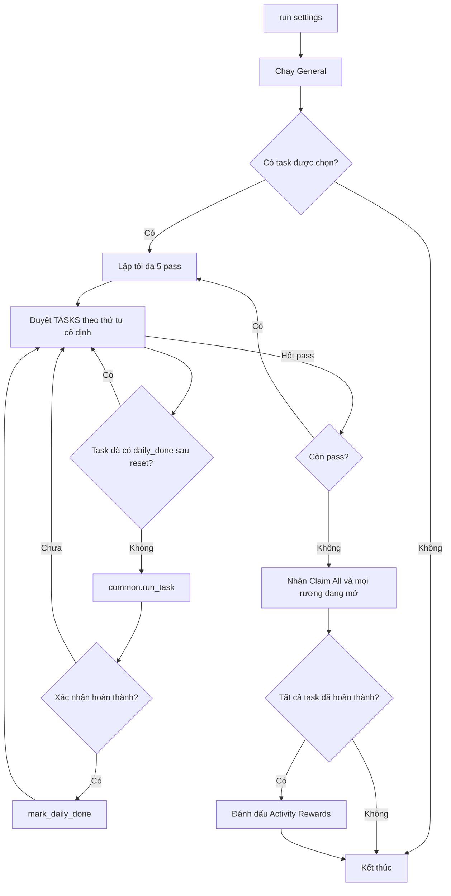
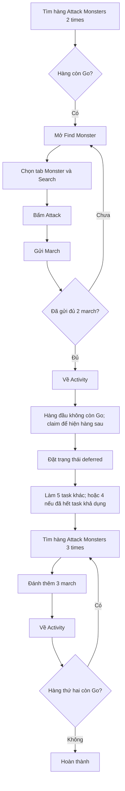
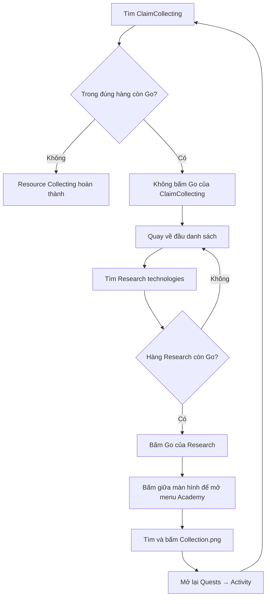

# Flow của Daily Activities

> Luồng mới (mở nhiệm vụ / bấm Go cho cả 2 phiên bản giao diện, sau Go giống Event): xem
> [OPEN_TASK.md](OPEN_TASK.md). Tài liệu dưới đây mô tả luồng cũ port từ C# (`common.run_task`).

Tài liệu này mô tả **code Python hiện tại** trong [run.py](run.py) (thứ tự nhiệm vụ),
[common.py](common.py) (vòng lặp chung `run_task`), các thư mục nhiệm vụ (mỗi nhiệm vụ một thư
mục giống activity Event: `constants.py` ảnh + `KEY` trong `bot/worker/priority.json`, `run.py`
handler + `TASK`), [general.py](general.py) và giao diện cấu hình tại
[daily_activities_tab.py](../../../ui/tabs/daily_activities_tab.py). Module được
chuyển từ `DailyActivities1234.cs`, nhưng một số luồng đã được sửa cho giao
diện Evony hiện tại.

Daily Activities không đọc dữ liệu trực tiếp từ game. Mỗi bước đều theo chu
trình: chụp màn hình → so khớp ảnh → thực hiện action → chụp lại và xác nhận.

## 1. Cách khởi chạy từ Evony Control App

1. Trong tab **Initialization**, chọn activity **Daily Activities**.
2. Trong tab **Daily Activities**, tích các nhiệm vụ muốn chạy.
3. Quay lại **Initialization** và bấm **Start**.
4. `BotWorker` gọi `daily_activities.run(bot, settings)`.

Số server chỉ được đọc khi chạy Join Monster War. Chạy riêng Daily Activities
không mở Settings để tìm server. Giờ reset server vẫn được dùng để quyết định
một nhiệm vụ đã hoàn thành trong ngày hay chưa; nếu chưa biết giờ reset thì
code dùng mốc 0 giờ máy làm fallback.

## 2. Cấu hình và nhiệm vụ được hỗ trợ

### General

| Cấu hình | Hành vi |
| --- | --- |
| `stamina_quantity` | UI: một ô chọn "Buy Stamina" 0, 10, 20 hoặc 30; 0 = không mua (mặc định). |
| `buy_stamina` | Tự suy ra từ UI (`stamina_quantity > 0`); giữ để tương thích cấu hình cũ. |
| `buy_all_hammers` | Checkbox "Buy Hammer": mua toàn bộ búa tìm thấy trong mục Special. |

General chạy trước danh sách nhiệm vụ Daily. Kết quả được lưu độc lập bằng
hai khóa `General: Buy Stamina` và `General: Buy All Hammers`.

### Selection Daily

Các nhiệm vụ được chạy theo đúng thứ tự sau, không theo thứ tự người dùng tích:

1. Monster Killing
2. Resource Collecting
3. Offering
4. Resource Gathering
5. Resource Tax
6. Gold Levy
7. Troop Training
8. Troop Heading (hiển thị là Troop Healing)
9. Trap Buiding (hiển thị là Trap Building)
10. Alliance Donation
11. Black Market
12. General Enhancing
13. Wheel of Fortune
14. Patrol
15. Material Composing

Các mục trong nhóm **Unavailable Daily** bị disable vì chưa có flow Python.

## 3. Điều phối tổng thể



- Mỗi task chỉ được lưu `daily_done` khi `common.run_task()` trả `True`.
- `daily_done` lưu timestamp trong database. Timestamp chỉ còn hiệu lực nếu
  nằm sau mốc reset server gần nhất.
- Module chạy tối đa 5 pass để có thể quay lại task chưa hoàn thành ở pass
  trước.
- Stop, timeout và thông báo boss được kiểm tra qua `bot.check()`.

## 4. State machine dùng chung cho một task

`common.run_task()` tạo danh sách template theo thứ tự ưu tiên rồi lặp liên tục.

| Action | Ý nghĩa |
| --- | --- |
| `DONE` | Thấy ảnh Finish của task; trả `True`. Không dùng cho những task có ảnh Finish dễ khớp nhầm. |
| `OPEN` | Tìm đúng hàng task và kiểm tra nút Go trong vùng 100 px của chính hàng đó. |
| `TAP` | Bấm template vừa nhận diện. |
| `BACK` | Bấm Back cho popup/ảnh thoát đã biết. |
| `SCROLL` | Cuộn danh sách Activity. Nếu vị trí không đổi nhiều lần, quay về đầu danh sách. |
| Không nhận diện | Chờ 1 giây rồi quét lại; không bấm Back mù vì có thể mở hộp Quit. |

### Kiểm tra nút Go theo đúng hàng

`common.open_task_row()` nhận góc trên trái của **nhãn task**, crop toàn bộ hàng cao
100 px rồi chỉ tìm `Go.png` trong vùng đó.

- Có Go và `open_when_available=True`: bấm Go, chờ chuyển màn hình.
- Có Go và `open_when_available=False`: trả trạng thái chưa hoàn thành nhưng
  không bấm Go.
- Không có Go: trả `ROW_COMPLETE`.
- Nhãn ở quá thấp (`y > 500`): cuộn nhẹ trước, chưa kết luận.

Việc một ảnh khác biến mất hoặc một nhiệm vụ trung gian hoàn thành **không tự
động chứng minh** task chính đã hoàn thành.

### Mở Quests → Activity

`common.open_daily_activity()` nhận diện các biến thể của nút Quests/Daily:

- `QuestButtonDaily.png`: ảnh người dùng cung cấp.
- `QuestButtonCurrent.png`: biến thể ngoài thành.
- `QuestButtonCity.png`: biến thể trong thành.

Sau đó bot bấm tab Activity và xác nhận bằng `Click_ActivitiesLight.png`. Khi
drawer tìm quái che nút Quests, bot dùng `BackToTerritoryCurrent.png` để về
thành; không dùng Android Back vì Back mở hộp Quit trên giao diện hiện tại.

## 5. Monster Killing

Monster Killing có hai mốc Daily liên tiếp: đánh 2 lần, sau đó đánh thêm 3 lần.



Chi tiết thao tác:

- `FindMonster.png` mở giao diện tìm kiếm.
- `TapMonster.png` chọn tab Monster trước khi bấm Search.
- Giao diện mới dùng nút xanh `AttackButtonCurrent.png`; giao diện cũ giữ
  fallback `AttackMonster.png`.
- Màn March ưu tiên `FullTiersCurrent.png`. Nếu nút này chỉ điền đội hình mà
  chưa gửi, bot bấm `MarchButtonCurrent.png`.
- Chỉ tăng bộ đếm march khi ảnh `March.png` biến mất sau thao tác gửi.
- Nếu tìm quái chưa sẵn sàng ba lần, bot chờ 5 giây; không bấm Back.
- Sau march 2 và march 5, bot quay lại Activity để kiểm tra trạng thái.

## 6. Resource Collecting

Đây là flow có **task chính** và **task trung gian**, phải phân biệt rõ:

| Ảnh | Vai trò |
| --- | --- |
| `ClaimCollecting.png` | Nhãn task Daily chính. Đây là hàng duy nhất dùng để xác nhận Resource Collecting đã xong. |
| `ActivitiesSourceCollecting.png` | Hàng `Research technologies`; chỉ là đường đi gián tiếp để mở Academy. Không dùng làm bằng chứng hoàn thành. |
| `Collection.png` | Nút Collection trong menu Academy; đây là hành động cần thực hiện. |



Quy tắc hoàn thành:

- Không dùng `Finish.png` hoặc `Finish1.png`. Trên client hiện tại,
  `Finish1.png` khớp đúng biểu tượng **Skill Book Shop**, khiến code cũ thoát
  trước khi bấm Collection.
- Không dùng trạng thái của hàng Research technologies để kết luận.
- Không dùng việc đã bấm Collection để kết luận.
- Chỉ khi tìm lại đúng `ClaimCollecting.png` và trong hàng đó không còn Go thì
  `common.run_task()` mới trả `True`.

## 7. Offering và Resource Gathering

Hai task này đứng liền nhau vì đều đưa bot về thành.

### Offering

1. Tìm hàng `Offer.png`, kiểm tra và bấm Go.
2. Trong Shrine, xử lý `Offer1.png` hoặc `OfferGems.png`.
3. Khi thấy `Offerfins.png`, tìm `Offer+.png`, bấm Plus hai lần rồi xác nhận.
4. Ảnh `Offerdone.png` hoặc `Offerdone1.png` là tín hiệu hoàn thành.

### Resource Gathering

1. Chạy ngay sau Offering.
2. Tìm hàng `GatherCityCurrent.png`, bấm Go nếu còn.
3. Trong thành, tìm `HandCurrent.png` và bấm bàn tay để thu các tài nguyên sẵn
   sàng.
4. Mở lại Quests → Activity.
5. Xác nhận từ đúng hàng task: không còn Go thì hoàn thành.

## 8. Resource Tax

1. Tìm hàng `ActivitiesTaxResource.png`, bấm Go.
2. `CityTax/menuTax.png` (menu Chợ, ảnh dùng chung với King's Path City Tax): bấm Tax.
3. `CityTax/taxScreen.png` (màn Tax, 4 dòng Lúa / Gỗ / Đá / Sắt): `resource_tax/run.py tax_all` theo group
   "City Tax" của tab: loại tích Free trước, thu hết lượt free rồi cộng thêm số chọn ("+" từ số mặc
   định của popup); rồi các loại khác đúng số chọn (OCR ô số popup, "+" / "−"). Xong thì Back về thành, coi như xong hôm nay.
4. `CityTax/popupCost.png` (popup Tax còn mở): Back.
5. Các ảnh `TaxFinish2.png`, `TaxFinish.png`, `TaxFinish1.png` báo hoàn thành.

## 9. Gold Levy

1. Tìm `LevyGoldActivityCurrent.png` hoặc `LevyGoldActivity1.png`, bấm Go.
2. `Levy.png`: mở menu tròn của công trình, chọn Levy rồi bấm hai nút Free
   Levy hiện tại.
3. `Levy1.png`: dùng trực tiếp hai tọa độ nút Free Levy.
4. `GemsLevyTimes.png`: nhập 5 và xác nhận.
5. `LevyGoldFinish.png` hoặc `LevyGoldFinish1.png` báo hoàn thành.

## 10. Troop Training

1. Mở từ hàng `TrainTroop.png`.
2. `Train.png`: bấm vào mục Train chung.
3. `TrainInterface.png`: vuốt ngang carousel quân.
4. `TrainSoldierCurrent.png`, `TrainSoldierSelectedCurrent.png` hoặc
   `TrainSoldier1.png`: nhập số lượng 500 và xác nhận.
5. `TroopSpeed.png`: dùng nút speedup hiện tại.
6. `TroopFinish.png` hoặc `TroopFinish1.png` báo hoàn thành.

## 11. Troop Healing

1. Mở từ hàng `HealActivity.png`.
2. `Heal.png`: vào chức năng Heal.
3. `Heal-i.png`: mở thông tin và cuộn hai lần.
4. `HealSelect.png`: nhập 150, xác nhận hai lần.
5. `HealFinishAll.png`: bấm Finish All.
6. `HealFinish.png` hoặc `HealFinish1.png` báo hoàn thành.

## 12. Trap Building

1. Mở từ `ActivitiesBuildTrap1.png` rồi `Build.png`.
2. `BuildInterface.png`: chọn trap tier I hiện tại, nhập 150 và xây.
3. `Trap-i.png`: trường hợp đã ở màn chọn trap, nhập 150 và xây trực tiếp.
4. `TrapSpeed.png`: dùng speedup, sau đó Back.
5. `TrapFinish.png` hoặc `TrapFinish1.png` báo hoàn thành.

## 13. Alliance Donation

1. Mở từ `ActivitiesDonateAlliance1.png`.
2. Khi thấy `AllianceCapacity.png`, crop từ hàng đó xuống 390 px.
3. Tìm nút `Donate.png` trong vùng crop và bấm.
4. Không tìm thấy Donate thì kết thúc pass hiện tại nhưng chưa ghi hoàn thành.
5. `AllianceDonateFinish.png` hoặc `AllianceDonateFinish1.png` báo hoàn thành.

## 14. Black Market

1. Mở từ `ActivitiesBlackMarket.png` rồi `BuyMarket.png`.
2. Khi thấy `Market.png` hoặc `Market1.png`, tìm lần lượt các mặt hàng tài
   nguyên: food, lumber, ore, stone.
3. Mỗi lần mua bấm xác nhận tại `(190, 415)`.
4. Tối đa ba lần mua trong lượt rồi Back.
5. Không dùng tọa độ Instant Refresh cũ vì client hiện tại tính phí gem.
6. `BlackMarketFinishCurrent.png` hoặc `BlackMarketFinish.png` báo hoàn thành.

## 15. General Enhancing

1. Mở từ `ActivitiesGeneralEnhancing.png`.
2. `Cultivate.png`: vào Cultivate.
3. `Cultivate1.png`: chạy tối đa năm lượt, chấp nhận cả `Agree.png` và
   `Disagree.png` theo logic ảnh hiện có.
4. Bấm nút dưới trái rồi Back.
5. `CultivateFinishCurrent.png` hoặc `CultivateFinish.png` báo hoàn thành.

## 16. Wheel of Fortune

1. Mở từ `ActivitiesWheelofFortune.png`.
2. `WheelofFortune.png`: tìm `SpinOnce.png` và quay một lần.
3. Bấm đóng/phần thưởng tại `(170, 550)` rồi Back.
4. `SpinFinishCurrent.png` hoặc `SpinFinish.png` báo hoàn thành.

## 17. Patrol

1. Mở từ `ActivitiesPatrol.png`.
2. `Patrol.png`: vào màn Patrol.
3. Với `Patrol1.png`, chạy ba lượt:
   - Lượt đầu: Select All → Patrol.
   - Lượt hai và ba: Refresh bằng gold → Select All → Patrol.
4. Back sau ba lượt.
5. `PatrolFinishCurrent.png` hoặc `PatrolFinish.png` báo hoàn thành.

## 18. Material Composing

1. Mở từ `ActivitiesComposeMaterials.png`.
2. `Lv1Crystal.png`: chờ rồi chọn vật liệu cấp 1.
3. `Crystal.png`: crop vùng 250 px từ hàng, tìm và bấm `Compose1.png`.
4. `Compose.png`: tìm `Lv3Crystal.png`, chọn rồi bấm Compose ba lần, sau đó
   Back.
5. `ComposeMaterialsFinishCurrent.png` hoặc `ComposeMaterialsFinish.png` báo
   hoàn thành.

## 19. General: mua thể lực và mua búa

### Buy Stamina

1. Mở Features (`chucnang.png`).
2. Vào Items → War.
3. Tìm Stamina và bấm Buy.
4. Bấm Plus `quantity - 1` lần; số lượng mặc định là 10.
5. Bấm nút mua và chỉ khi flow trả `True` mới đánh dấu đã mua hôm nay.

### Buy All Hammers

1. Mở Features → Items → Special.
2. Tìm offer búa (`bua.png`).
3. Bấm bên trái nút Plus để chọn số lượng tối đa.
4. Xác nhận mua.
5. Nếu kiểm tra Special quá năm lần mà không thấy búa, trả `False`.

Mỗi flow General có giới hạn `MAX_STEPS = 100`; quá giới hạn sẽ log và dừng,
không đánh dấu hoàn thành.

## 20. Nhận thưởng Activity

Sau các pass, nếu `Activity Rewards` chưa được ghi hoàn thành:

1. Đóng popup `CongratulationsCurrent.png` bằng Back.
2. Nếu có `Claim_All.png`, bấm Claim All trước để cộng điểm Activity.
3. Tìm mọi `OpenChestCurrent.png` trong riêng hàng rương.
4. Mỗi screenshot chỉ bấm một rương, xử lý popup rồi chụp lại; không dùng lại
   tọa độ cũ vì UI thay đổi sau mỗi lần nhận.
5. Tiếp tục tới khi không còn rương đang mở.
6. Chỉ ghi `Activity Rewards` vào database nếu tất cả task được chọn đã có
   `daily_done`.

## 21. Ảnh, vùng tìm kiếm và cache

- Ảnh nằm dưới `Images/DailyActivites/<folder task>/`.
- `find_first()` dùng cache vị trí riêng theo BotContext. Sau lần tìm thấy đầu,
  bot ưu tiên vùng nhỏ quanh vị trí cũ và vẫn có fallback toàn màn hình.
- Những ảnh nhãn hàng cần trả góc trên trái thay vì tâm để crop đúng 100 px.
- Các nút có nhiều giao diện giữ nhiều template: `*Current.png` cho client hiện
  tại và ảnh cũ làm fallback.
- Thứ tự template có ý nghĩa. Một ảnh Finish đặt trước action có thể kết thúc
  task sai nếu nó trùng với icon khác; Resource Collecting đã loại bỏ Finish vì
  lý do này.

## 22. Database và reset ngày

Các khóa hoàn thành được lưu trong trường `daily_done` của thiết bị:

```text
{
  "Monster Killing": "2026-10-03T18:00:00",
  "Resource Collecting": "2026-10-03T18:10:00",
  "General: Buy Stamina": "2026-10-03T18:15:00",
  "Activity Rewards": "2026-10-03T18:30:00"
}
```

Code không xóa bản ghi mỗi ngày. `done_today()` so timestamp với mốc reset gần
nhất; bản ghi cũ tự động không còn được coi là hoàn thành.

## 23. Kiểm thử và giới hạn xác nhận

Các test chính:

- [test_daily_activities.py](../../../tests/daily_activities/test_daily_activities.py): state
  machine, kiểm tra hàng/Go, Monster 2+3, Resource Collecting và nhận rương.
- [test_general.py](../../../tests/daily_activities/test_general.py): mua thể lực và
  búa.

Chạy unit test:

```powershell
.\venv\Scripts\python.exe -m unittest tests.daily_activities.test_daily_activities tests.daily_activities.test_general
```

Unit test xác nhận quyết định của code với màn hình/mocks đã biết; nó không tự
chứng minh toàn bộ luồng thật trên mọi tài khoản hoặc mọi phiên bản Evony. Với
thay đổi ảnh hay giao diện, cần chạy thật trên giả lập (`tests/real_run.py`, `poe test`)
trước khi kết luận flow đã đúng hoàn toàn.
