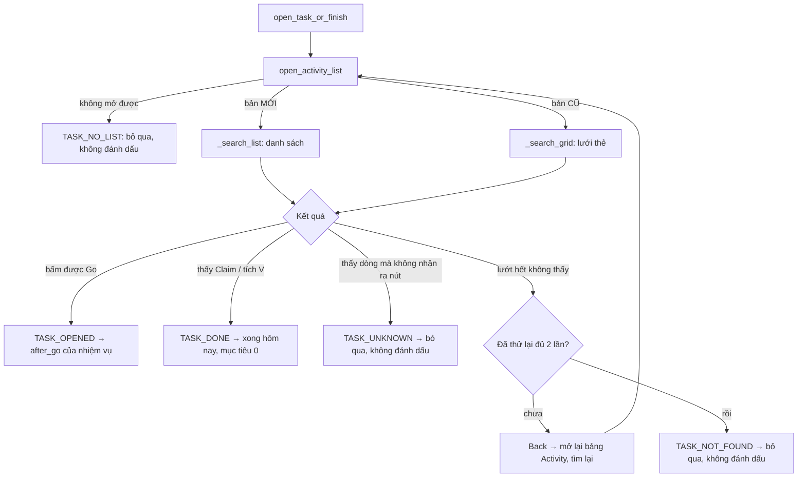
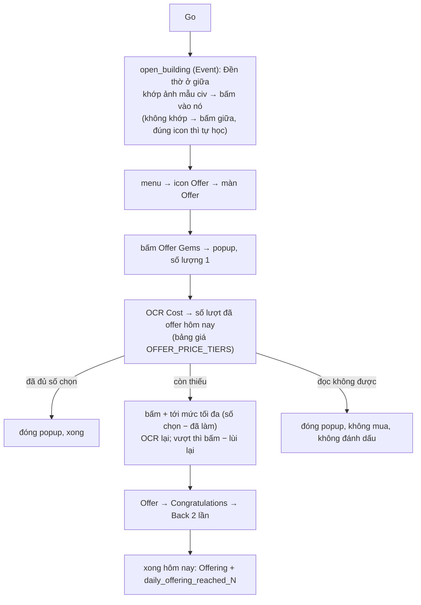

# Daily Activities — flow mở nhiệm vụ và bấm Go

Phần chung của **mọi** nhiệm vụ Daily: từ màn chính tới lúc bấm **Go** của nhiệm vụ. Sau Go mỗi nhiệm vụ làm
phần riêng (`<nhiệm vụ>/run.py after_go`), giống Event: nhận ra công trình → menu → icon chức năng.

Code: [common.py](common.py) `open_task_or_finish` → `open_task` → `open_activity_list` + `_search_list` /
`_search_grid`. Hằng số / ảnh: [constants.py](constants.py). Test: `tests/daily_activities/`
(`test_open_task.py` + `<nhiệm vụ>/test_flow.py`).

## 1. Tổng quan

**Chỉ đánh dấu xong khi thấy rõ dấu hiệu xong** (nút Claim / tích V). Mọi trường hợp "không chắc" đều bỏ qua để
lần chạy sau thử lại.

## 2. Mở bảng Activity — `open_activity_list`

Mỗi vòng chụp màn hình rồi làm **một** việc (tối đa `OPEN_ACTIVITY_TRIES` = 8 vòng):

| Thấy trên màn | Làm | Ghi chú |
| --- | --- | --- |
| Ngôi sao điểm Activity (`ACTIVITY_LIST`) | → **bản MỚI**, xong | đang ở danh sách |
| Tiêu đề "Activity" của lưới thẻ (`OLD_ACTIVITY_TITLE`) | → **bản CŨ**, xong | đang ở lưới |
| (một trong hai dòng trên) ngay **lần nhìn đầu** | **Back** đóng, mở lại từ đầu | có thể đang ở giữa danh sách; **không bao giờ cuộn lên** |
| Chữ tab "Activity" (`ACTIVITY_TAB`) | bấm | popup Quests đang ở tab khác |
| Mục "Activity" của bảng chức năng (`OLD_MENU_ACTIVITY`) | bấm | bản cũ, sau khi bấm "•••" |
| Nút "•••" của màn chính (`MAIN_MORE`) | có nút Quests góc dưới trái → bấm Quests (bản mới); không có → bấm "•••" (bản cũ) | |
| Không nhận ra | `go_home` (Back / về màn chính) | |

## 3. Bản MỚI — danh sách Activity (`_search_list`)

Lặp, mỗi vòng một ảnh chụp (tối đa `LIST_MAX_SCROLLS` = 12 lần cuộn):

1. **Claim All** (`CLAIM_ALL`) còn sáng (`_active_claim_all`: nút xám cũng khớp ảnh mẫu 0,86 nên xét thêm độ bão hoà
   màu ≥ `CLAIM_ALL_MIN_SATURATION`) → bấm (không hiện popup). Bấm mà Claim All vẫn còn (lỗi game) → bỏ qua Claim
   All tới hết lượt mở nhiệm vụ này.
2. Tìm **tiêu đề dòng** của nhiệm vụ (`task_titles`: ảnh trong `ACTIONS` có action OPEN…, VD
   `ActivitiesOffer/Offer.png` = "Use the Offer feature in Shrine" — chỉ phần chữ, không lấy "for N time(s)"
   nên dòng lần 1 / lần 2 đều khớp).
3. Thấy tiêu đề:
   - nằm sát đáy (y > `ROW_TITLE_MAX_Y` = 580, nút có thể bị thanh Claim All che) và còn cuộn được → cuộn tiếp;
   - còn lại: xét **nút ngay dưới tiêu đề** (`_row_button`): cách tâm tiêu đề `ROW_BUTTON_DY` = 42 px (±10):
     - **Go** → bấm → `TASK_OPENED`;
     - **Claim** / **tích V** → `TASK_DONE`;
     - không nhận ra → chờ `ROW_SETTLE_WAIT` = 1 s (danh sách có thể còn trôi sau khi cuộn), chụp lại, xét lại một
       lần; vẫn không nhận ra → `TASK_UNKNOWN`.
4. Không thấy → vuốt `LIST_SWIPE` (cuộn ~105 px). Danh sách không đổi sau khi vuốt (`_same_list`, vùng y
   340–600 giống ≥ 0,99) = **hết danh sách** → `TASK_NOT_FOUND`.

Nút Go chỉ nhận cái nằm **ngay dưới tiêu đề**, nên không bấm nhầm Go của dòng bên trên / dưới.

## 4. Bản CŨ — lưới thẻ (`_search_grid`)

Bản cũ không có Claim All. Thay vào đó, thẻ nhiệm vụ đã đủ **100%** đổi icon thành **hộp quà** (có hiệu ứng, không làm ảnh
mẫu được): nhận ra bằng chữ **"100%"** ở góc trên trái thẻ (`OLD_DONE_BADGE`) → bấm giữa thẻ để nhận trước (bấm mà
vẫn còn → bỏ qua tới hết lượt này), rồi mới tìm thẻ. Thẻ 100% **chưa nhận** luôn nằm ở **đầu lưới**, nên chỉ bấm
nhận khi **chưa cuộn**; đã cuộn xuống mà thấy "100%" là thẻ **đã nhận** rồi → không bấm. Bấm nhận xong game hiện popup
**"Congratulations!"** (phần thưởng; không tự tắt, bấm vào không đóng) → **Back** đóng (`OLD_CONGRATS`, vẫn ở lưới).

Thẻ **đã nhận** chuyển xuống **cuối lưới**, icon cũ có dấu tích xanh + chữ **"Completed"**. Mỗi nhiệm vụ một ảnh
`<thư mục ảnh>/Done.png` (`task_done_cards`, cắt cùng chỗ với `Card.png`, ngưỡng `OLD_DONE_CARD_THRESHOLD` = 0,85):
thấy → `TASK_DONE` (không bấm thẻ). Đã có: Resource Collecting, Offering, Resource Tax, Gold Levy, Troop Training, Troop Healing, Trap Building (thẻ xong 0,89..1,00; cùng thẻ chưa nhận <= 0,77;
Done nhiệm vụ khác <= 0,53).
Ảnh lưới: `tests/daily_activities/screens/22_old_grid_top_100.png`, `23_old_grid_end_completed.png`,
`24_old_grid_end_offering_completed.png`, `25_old_grid_end_tax_completed.png`, `27_old_grid_end_levy_completed.png`, `28_old_grid_end_train_completed.png`, `29_old_grid_end_heal_completed.png`, `30_old_grid_end_trap_completed.png`; popup sau khi nhận:
`26_old_grid_claim_congrats.png`.

1. Tìm **ảnh thẻ** của nhiệm vụ (`<thư mục ảnh>/Card.png`, `task_cards`; ngưỡng `OLD_CARD_THRESHOLD` = 0,85).
   Nhiệm vụ chưa có ảnh thẻ → `TASK_UNKNOWN`.
2. Thấy thẻ → bấm → chờ popup có **Go** (`OLD_POPUP_GO`, tối đa `OLD_POPUP_TIMEOUT` = 4 s):
   - có Go → bấm → `TASK_OPENED`;
   - không có → Back → `TASK_UNKNOWN` (chưa có ảnh popup "đã xong" nên không đoán).
3. Không thấy → vuốt `LIST_SWIPE`; hết lưới → `TASK_NOT_FOUND`.

## 5. Không thấy nhiệm vụ — thử lại 2 lần (không bao giờ cuộn lên)

`TASK_NOT_FOUND` lần đầu (có thể do cuộn trượt qua dòng) → **Back** đóng bảng Activity → mở lại từ đầu (mục 2) →
tìm lại (`LIST_RETRIES` = 2). Vẫn không thấy → `TASK_NOT_FOUND`: bỏ qua, **không** đánh dấu xong.

## 6. Đánh dấu xong — `mark_task_done`

| Kết quả | daily_done | Ý nghĩa |
| --- | --- | --- |
| `TASK_DONE` | `"<nhãn>"` + `"<key>_reached_0"` | xong hôm nay, mục tiêu 0 (không còn gì để làm) |
| nhiệm vụ làm xong theo số lượng (VD Offering) | `"<nhãn>"` + `"<key>_reached_<N>"` | xong với số lượng N; người dùng tăng số lượng → chạy lại |
| `TASK_NOT_FOUND` / `TASK_UNKNOWN` / `TASK_NO_LIST` | (không lưu) | lần chạy sau thử lại |

`<key>` = key trong `bot/worker/priority.json` (VD `daily_offering`). daily_done tính tới lần reset server: sang
ngày mới chạy lại bình thường.

## 7. Sau Go — ví dụ Offering ([offering/run.py](offering/run.py))

Giá mỗi lượt Offer Gems: 1: 25, 2: 50, 3–4: 100, 5–6: 200, 7–8: 400, 9–10: 600, 11–15: 1.000, 16+: 1.500.
Tab UI: "Offering" trong Selection Daily là ô chọn số lần Offer Gems 0 / 3 / 5 / 10 / 15 / 20 / 30 (thay checkbox;
mặc định 0 = không làm, lưu `Offering = False`; > 0 lưu `Offering = True` + `Offer Gems = số lần`).

## 8. Thêm một nhiệm vụ mới

1. `constants.py` của nhiệm vụ: `KEY` (theo `priority.json`), `LABEL`, ảnh tiêu đề dòng trong `ACTIONS` (action OPEN),
   ảnh thẻ bản cũ `Card.png` trong thư mục ảnh.
2. `run.py`: `after_go(bot)` cho phần sau Go (thường `event/kings_path/building.py open_building` + icon chức năng),
   cuối cùng `mark_task_done` / đánh dấu theo số lượng.
3. Test `tests/daily_activities/<nhiệm vụ>/`: chép ảnh phần chung (`tests/daily_activities/screens/01..04`) +
   ảnh riêng sau Go; `test_flow.py` dùng `TO_ACTIVITY`, `CLAIM_ALL_ONCE`, `open_task_of` trong
   `tests/daily_activities/__init__.py`.
