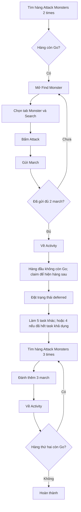

# Flow: Monster Killing

Nhiệm vụ Daily Activities. Ảnh / action: [constants.py](constants.py), handler: [run.py](run.py).
Phần dùng chung (mở Quests → Activity, tìm dòng, bấm Go, state machine `run_task`): [../FLOW.md](../FLOW.md).

Monster Killing có hai mốc Daily liên tiếp: đánh 2 lần, sau đó đánh thêm 3 lần.

Chi tiết thao tác:

- `FindMonster.png` mở giao diện tìm kiếm.
- `TapMonster.png` chọn tab Monster trước khi bấm Search.
- Giao diện mới dùng nút xanh `AttackButtonCurrent.png`; giao diện cũ giữ
  fallback `AttackMonster.png`.
- Màn March ưu tiên `FullTiersCurrent.png`. Nếu nút này chỉ điền đội hình mà
  chưa gửi, bot bấm `MarchButtonCurrent.png`.
- Chỉ tăng bộ đếm march khi ảnh `March.png` biến mất sau thao tác gửi.
- Nếu tìm quái chưa sẵn sàng ba lần, bot chờ 5 giây; không bấm Back.
- Sau march 2 và march 5, bot quay lại Activity để kiểm tra trạng thái.
