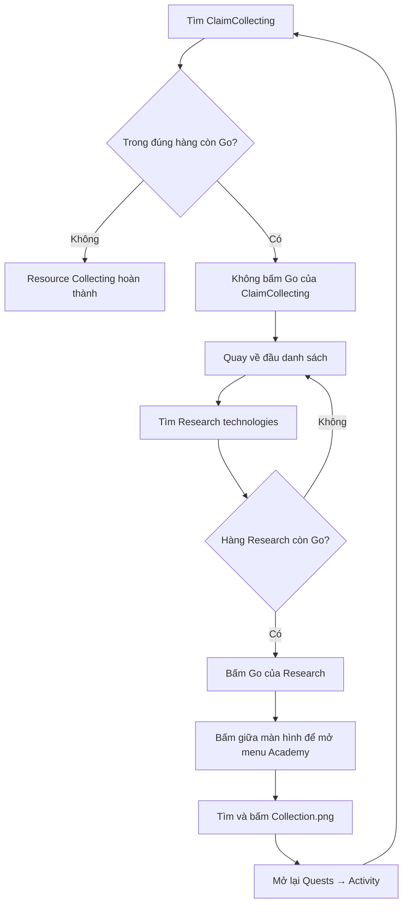

# Flow: Resource Collecting

Nhiệm vụ Daily Activities. Ảnh / action: [constants.py](constants.py), handler: [run.py](run.py).
Phần dùng chung (mở Quests → Activity, tìm dòng, bấm Go, state machine `run_task`): [../FLOW.md](../FLOW.md).

Đây là flow có **task chính** và **task trung gian**, phải phân biệt rõ:

| Ảnh | Vai trò |
| --- | --- |
| `ClaimCollecting.png` | Nhãn task Daily chính. Đây là hàng duy nhất dùng để xác nhận Resource Collecting đã xong. |
| `ActivitiesSourceCollecting.png` | Hàng `Research technologies`; chỉ là đường đi gián tiếp để mở Academy. Không dùng làm bằng chứng hoàn thành. |
| `Collection.png` | Nút Collection trong menu Academy; đây là hành động cần thực hiện. |

Quy tắc hoàn thành:

- Không dùng `Finish.png` hoặc `Finish1.png`. Trên client hiện tại,
  `Finish1.png` khớp đúng biểu tượng **Skill Book Shop**, khiến code cũ thoát
  trước khi bấm Collection.
- Không dùng trạng thái của hàng Research technologies để kết luận.
- Không dùng việc đã bấm Collection để kết luận.
- Chỉ khi tìm lại đúng `ClaimCollecting.png` và trong hàng đó không còn Go thì
  `common.run_task()` mới trả `True`.
