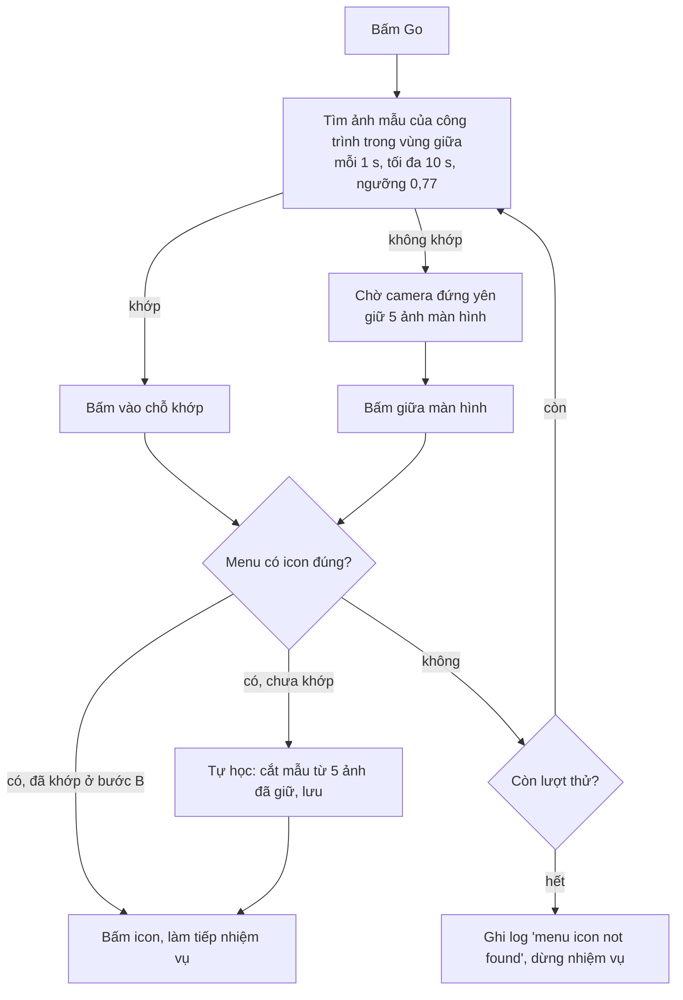

# Nhận diện công trình sau khi bấm Go

Code: [city_building.py](city_building.py). Dùng bởi King's Path ([kings_path/building.py](kings_path/building.py))
và Gather Troops ([gather_troops/train_troop/run.py](gather_troops/train_troop/run.py) `_open_building_menu`).
Daily Activities chưa dùng.

## 1. Vấn đề

Bấm **Go** ở một dòng nhiệm vụ → game đưa về thành chính và kéo công trình của nhiệm vụ vào giữa màn
hình (City Tax → Chợ, Heal → Bệnh viện, ...). Cách cũ là bấm mù vào giữa rồi xem menu có đúng icon không.

Hình công trình **khác nhau theo nền văn minh** của tài khoản (7 loại), nên không thể dùng một bộ ảnh cố
định. Mỗi nền văn minh có bộ ảnh mẫu riêng.

| Nhiệm vụ | Công trình (`building`) | Icon trong menu |
| --- | --- | --- |
| KP City Tax | `market` | Tax |
| KP Black Market | `market` | Black Market |
| KP Patrol | `walls` | Patrol |
| KP Heal | `hospital` | Heal / Speed Up |
| KP Refine | `forge` | Craft |
| KP Train Troop | `troop` (tìm cả `barracks`, `archer_camp`, `stables`, `workshop`) | Train / Speed Up |
| GT Ground / Ranged / Mounted / Siege | `barracks` / `archer_camp` / `stables` / `workshop` | Train / Speed Up |
| GT Defense Force | `defense_force` | Build / Speed Up |

Có mẫu nhưng chưa nối vào nhiệm vụ nào: `academy`, `shrine`, `keep` (Daily: Resource Collecting, Offering,
Gold Levy), `pasture`, `art_hall`, `battlefield`.

## 2. Luồng sau khi bấm Go

- **Khớp mẫu → bấm vào chỗ khớp**, không bấm giữa. Camera bị lướt lệch (công trình vẫn trong vùng tìm) vẫn
  bấm đúng. Đã khớp thì **không học thêm**.
- **Không khớp** → bấm giữa để thử; chỉ lưu mẫu mới khi menu hiện **đúng icon** (sai icon không lưu gì, nên
  không học nhầm công trình khác).
- Số lượt thử: King's Path `MENU_TRIES` = 2; Gather Troops 2 lần.
- Vùng tìm `BUILDING_REGION` = (15, 25, 85, 70) % màn hình. Lướt ra ngoài vùng này thì coi như không khớp.

## 3. Ảnh mẫu: hai nguồn

| | Ảnh có sẵn | Ảnh tự học |
| --- | --- | --- |
| Thư mục | `Images/Event/Building/civ<N>/<building>/*.png` | `%LOCALAPPDATA%\EvonyBot\buildings\civ<N>\<building>\*.png` |
| Ai tạo | Người làm bot (chụp tay, xem mục 6) | Bot, lúc chạy |
| Có trong git / bản build | Có (build chép cả `Images/`) | Không, riêng từng máy |
| Khi cập nhật app | Bị thay bằng bản mới | Giữ nguyên |
| Bot có ghi vào không | Không | Có (tối đa `MAX_SAMPLES` = 3 ảnh / công trình, đầy thì xoá ảnh cũ nhất) |

Bot đọc **cả hai** (ảnh có sẵn trước). Hiện có đủ 7 nền văn minh × 16 công trình ảnh có sẵn.

Một công trình có thể có nhiều ảnh (`1.png`, `2.png` hoặc `01.png` ... `10.png`); khớp ảnh nào cũng được.
Bệnh viện dùng nhiều ảnh nhất (5 – 10) vì dấu "+" bay lên ở vị trí khác nhau.

Nâng cấp làm công trình đổi hình: **tự cập nhật** ảnh có sẵn (chụp lại), bot không tự học lại khi vẫn còn khớp.

## 4. Nền văn minh của thiết bị

- Lưu DB: cột `devices.civilization` (1 .. 7, NULL = chưa biết). `BotWorker` nạp vào `bot.civilization` lúc
  chạy; bot tự xếp thì gọi `bot.set_civilization(n)` → signal `civilization_found` → `Database.set_civilization`.
- **Đã biết civ N**: chỉ tìm ảnh của civ N (nhanh, không nhầm civ khác).
- **Chưa biết**: tìm ảnh của mọi civ; khớp ảnh civ N → gán máy vào civ N (lưu DB).
- Chưa biết mà không khớp civ nào, menu đúng icon (tự học, `remember_building`):
  - chưa có civ nào → tạo civ 1;
  - đã có civ học công trình này mà không khớp → civ mới (số nhỏ nhất còn trống, tối đa 7). Đủ 7 civ rồi
    thì không lưu (ghi log);
  - chưa civ nào có công trình này → lưu tạm `buildings\pending\<serial>\`, chuyển vào civ N khi máy được gán.

Với bộ ảnh có sẵn hiện tại (đủ 7 civ), máy mới sẽ được xếp civ ngay ở công trình đầu tiên khớp.

## 5. Cách cắt mẫu

Ảnh mẫu là **vùng đứng yên lớn nhất trên thân công trình** qua nhiều khung chụp liên tiếp, lấy **trung vị**
các khung (xoá hiệu ứng thoáng qua): `stable_window` → `stable_crop`.

- Pixel "đứng yên": độ lệch chuẩn theo thời gian < `STILL_STD` (2 mức xám).
- Khung lớn nhất (≥ `LEARN_MIN_SIZE` = 40×25 px) có tỉ lệ pixel dao động ≤ 2 %; không có thì nới dần
  `MOVING_STEPS` (5 %, 10 %, 20 %, 35 %).
- Chỉ xét trong `LEARN_AREA` (màn 396×704: x 118 – 278, y 318 – 374):
  - **trên**: thanh thời gian + chữ khi nâng cấp / train / heal / nghiên cứu (dài nhất tới y ≈ 315), bong
    bóng icon, búa event;
  - **dưới**: huy hiệu số cấp ở chân công trình (y ≥ 378, đổi khi nâng cấp);
  - **ngang**: trên thân công trình, không lấn ra nền đất / hàng rào.
- Khi tự học lúc chạy: `LEARN_FRAMES` = 5 khung, cách nhau 1 s, sau khi camera đứng yên.

Kết quả đo (7 civ × 16 công trình, 403+ ảnh tests): khớp đúng ≥ 0,92 (thấp nhất: Academy civ 1 lúc đang nghiên
cứu, mẫu chụp lúc rảnh), khớp nhầm công trình / civ khác ≤ 0,61 → `BUILDING_THRESHOLD` = 0,77.

## 6. Thêm / cập nhật ảnh có sẵn (chụp tay)

1. Đưa công trình ra giữa màn trên giả lập (đúng nền văn minh), đóng menu / popup.
2. Chụp 30 khung trong 30 s (công trình ít thay đổi: 10 khung / 10 s đủ).
3. Cắt bằng `stable_window` + trung vị → `Images/Event/Building/civ<N>/<building>/1.png`.
   - Hiệu ứng nhiều (Bệnh viện, Chợ): dùng khung to trên thân công trình + **nhiều ảnh**: bắt đầu từ trung vị,
     thêm khung khớp kém nhất tới khi mọi khung khớp ≥ 0,97 (tối đa 10 ảnh).
   - Có chữ tên công trình / bong bóng "?" / huy hiệu cấp lấn vào: thu hẹp vùng cắt cho từng máy.
4. **Xem ảnh** vùng cắt trên màn hình trước khi lưu (không dính thanh thời gian, bong bóng, búa, huy hiệu).
5. Kiểm tra: mẫu khớp lại mọi khung ≥ 0,97; khớp nhầm công trình / civ khác < 0,77.
6. Lưu vài ảnh màn hình đầy đủ làm ảnh test: `tests/event/city_building/screens/civ<N>/<building>/NN.png`
   (bỏ các ảnh gần giống nhau, điểm ≥ 0,99). Ảnh công trình có thanh thời gian: `busy_*.png`.
7. Công trình mới: thêm hằng số trong [city_building.py](city_building.py) (VD `PASTURE = "pasture"`).

## 7. Hằng số chính ([city_building.py](city_building.py))

| Hằng số | Giá trị | Ý nghĩa |
| --- | --- | --- |
| `BUILDING_REGION` | (15, 25, 85, 70) % | Vùng tìm ảnh mẫu |
| `BUILDING_THRESHOLD` | 0,77 | Ngưỡng khớp mẫu |
| `BUILDING_TIMEOUT` / `BUILDING_INTERVAL` | 10 s / 1 s | Thời gian tìm mẫu / chờ camera đứng yên |
| `LEARN_AREA` | (29,8, 45,2, 70,2, 53,1) % | Vùng cắt mẫu |
| `LEARN_MIN_SIZE` | (10,1, 3,6) % | Cỡ mẫu tối thiểu (40×25 px) |
| `LEARN_FRAMES` | 5 | Số khung khi tự học |
| `STILL_STD` / `MOVING_STEPS` | 2,0 / (0,02 … 0,35) | Pixel đứng yên / tỉ lệ dao động cho phép |
| `MAX_SAMPLES` | 3 | Số ảnh tự học tối đa mỗi công trình |
| `MAX_CIVS` | 7 | Số nền văn minh |
| `LEARNED_DIR` | `%LOCALAPPDATA%\EvonyBot\buildings` | Thư mục ảnh tự học |
| `BUNDLED_DIR` | `Images/Event/Building` | Thư mục ảnh có sẵn |

## 8. Test

- Flow test ([tests/flow.py](../../../tests/flow.py)) ghi ảnh tự học vào thư mục tạm (`LEARNED_DIR` được patch),
  không đụng `%LOCALAPPDATA%`; `device.learned_dir` để chép ảnh học sẵn trong `setup`.
- Ảnh test theo nền văn minh: `tests/event/city_building/screens/civ1..7/<building>/`.
- Chưa có test riêng cho `city_building` (TODO).

## Liên quan: đọc cấp lính không cần hình lính

Hình lính ở màn Train cũng khác theo nền văn minh. Cấp lính đọc bằng **huy hiệu số La Mã** cạnh tên lính
(`Images/Event/GatherTroops/Train/Badge/1..16.png`, dùng chung mọi civ), vòng đang chọn tìm theo viền cam —
xem [gather_troops/troop_tier.py](gather_troops/troop_tier.py).
