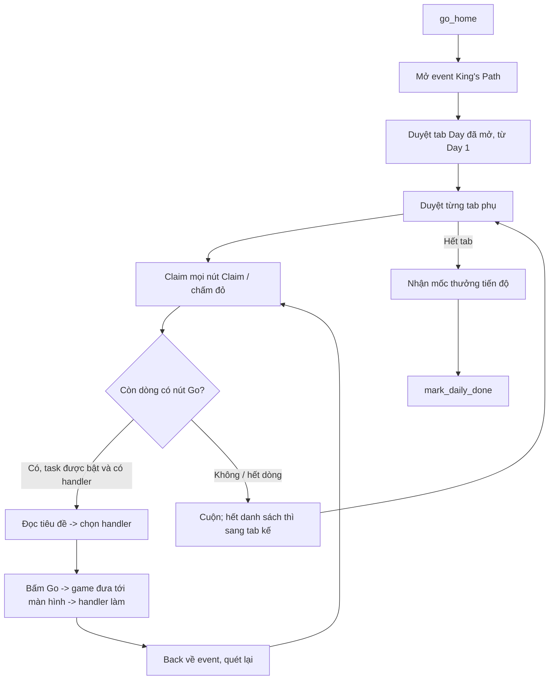

# Kịch bản King's Path

> **Trạng thái (2026-10-01):** đã code phần từ màn chính tới bấm Go cho City Tax, Patrol, Donate,
> Train Troop, Offer, Heal, Wheel — [kings_path/](kings_path/) (flow chung: [path_task.py](kings_path/path_task.py),
> test: `tests/event/kings_path/`). Còn thiếu: ảnh icon King's Path trong danh sách event
> (`Images/Event/KingsPath/icon.png`; chưa có thì nhiệm vụ tự bỏ qua), phần sau Go của từng nhiệm vụ,
> Black Market (Day 5). Phần dưới là bản nháp ban đầu. Việc còn lại: [kings_path/TODO.md](kings_path/TODO.md).

## 0. Màn hình thật (ảnh `tests/event/kings_path/screens/`)

| Day | Tab phụ (trái -> phải) | Nhiệm vụ bot làm |
| --- | --- | --- |
| 1 | City Tax · Hoarding · Mining | City Tax: "Tax on resources for N time(s)" (3/10/20/40/...) |
| 2 | Unstoppable · Try Your Best · Teamwork | Teamwork: "Patrol for N time(s)" + "Donate to the Alliance N time(s)" (cùng tab, tìm dòng theo tiêu đề) |
| 3 | Strong Troops · God's Blessing · Healing Heart | "Train N Troop(s)", "Offer N time(s)", "Heal N troops" |
| 4 | Accumulation · Fortune Wheel · Sharp Weapons | "Spin the Wheel of Fortune N time(s)" |
| 5 | (khoá) | Black Market? — chưa có ảnh |

Hàng tab Day giống hệt Gather Troops (ảnh khớp chéo 1,00) — phải thấy tiêu đề "King's Path" mới coi là đúng màn.
Unstoppable (Day 2) là "Defeat N Boss Monsters with the power of above X" — để sau.

Mục tiêu: activity **Event** ([run.py](run.py), hiện chỉ là stub) tự làm nhiệm vụ King's Path theo ngày, rồi nhận thưởng. Tài liệu này chỉ chốt kịch bản; phần này không viết flow test.

## 1. Cấu trúc màn hình event (giả định, cần chụp xác nhận)

Theo ảnh mẫu của event cùng khung (`Images/Event/Screenshot_*.png` là "Gather Troops"):

- Thanh trên: mốc thưởng tiến độ (5/10/30/50/70) + `Progress: x / y`.
- Hàng tab **Day 1 … Day N**; ngày chưa mở thì tab mờ.
- Tab phụ trong ngày (vd "Be Prepared" / "Recruit More"), chấm đỏ = có thưởng chưa nhận.
- Danh sách dòng nhiệm vụ: tiêu đề `... for N time(s)`, bộ đếm `a / b`, nút **Go** / **Claim** / **Claimed**.

Ảnh đã có dùng lại được: `Event/day1.png`, `go.png`, `claimed.png`, `done.png`, `bePrepared.png`, `recruitMore.png`, `loginGift.png`, `loginGiftDone.png`, `time10..time1000.png`, `CloseEvent/1.png`.

## 2. Vòng chạy chính



Nguyên tắc:

- Nhận diện dòng bằng **tiêu đề** (template chữ cắt từ ảnh thật), không bằng vị trí, vì thứ tự dòng thay đổi khi có dòng xong.
- Dòng không có handler hoặc bị tắt trong cấu hình thì **bỏ qua** (blacklist theo lượt chạy) để khỏi kẹt.
- Mỗi handler có giới hạn số lần thử; hết thì bỏ qua dòng đó.
- Đánh dấu xong trong ngày bằng `bot.mark_daily_done("King's Path")` khi không còn Go nào làm được; reset theo `daily_reset` như Daily Activities.

## 3. Bảng nhiệm vụ → cách làm

"Tái dùng" = đã có logic trong [daily_activities/run.py](../daily_activities/run.py) (chỉ cần tách handler ra dùng chung, vì ở đó nó đi vào qua màn Daily Activities chứ không qua nút Go của event).

| Ngày | Nhiệm vụ | Cách làm | Mức |
| --- | --- | --- | --- |
| 1 | Daily Login | Chỉ cần Claim | Dễ |
| 1 | City Tax (thu thuế Keep) | Tái dùng `_resource_tax` / `_gold_levy`; số lần từ `kings_path_city_tax` | Tái dùng |
| 1 | Produce RSS in City | Bấm thu hoạch trên mỏ trong thành (icon nổi trên nhà); gần với `_collecting` | Mới, nhỏ |
| 2 | Alliance Help (≤300 lần) | Bấm nút Help All của Liên minh lặp theo chu kỳ; không đủ yêu cầu thì để chạy nền nhiều lượt trong ngày. Acc phụ spam yêu cầu nằm ngoài phạm vi bot | Mới, chạy lâu |
| 2 | Donate to Alliance | Tái dùng `_donate` (+ activity `alliance_capacity`); số lần từ `kings_path_donate` | Tái dùng |
| 2 | Patrol | Tái dùng `_patrol`; số lần từ `kings_path_patrol` | Tái dùng |
| 3 | Heal Troops | Tái dùng `_troop_heal` | Tái dùng |
| 3 | Train Troops | Tái dùng `_troop_train` | Tái dùng |
| 3 | Consume Stamina | Tái dùng `_attack_monster` (đánh quái thường) | Tái dùng |
| 4 | Wheel of Fortune | Tái dùng `_wheel` | Tái dùng |
| 4 | Buy Black Market | Tái dùng `_black_market` / activity `black_market` | Tái dùng |
| 4 | Gather RSS outside | Tìm mỏ trên bản đồ + march quân; chưa có code | Mới, vừa |
| 5–7 | Defeat Boss / Alliance War (rally) | Gọi `join_monster_war` có giới hạn số lần join, không chạy vô hạn | Tái dùng + sửa |
| 5–7 | Refine Equipment | Mở Tướng → Trang bị → Refine, bấm N lần | Mới, vừa |
| 5–7 | Attack Castles / Kill Enemies | **Không tự động** (PvP, rủi ro mất quân) — chỉ Claim khi người chơi tự làm xong | Bỏ qua |

Mẹo "đem lính T1 đánh quái mạnh để có lính bị thương rồi chữa" **không** đưa vào bot mặc định: tốn quân và khó kiểm soát. Có thể thêm sau như tuỳ chọn tắt sẵn.

## 4. Cấu hình (tab Event)

Nhiệm vụ, lựa chọn, level lính, ngày mở và mặc định khai báo ở [ui/tabs/event.json](../../../ui/tabs/event.json); tab [event_tab.py](../../../ui/tabs/event_tab.py) dựng UI từ file này.

Settings (cột `event` trong DB, cũng là `settings` mà `run(bot, settings)` nhận) có dạng:

```json
{
  "gather_troops_cultivate_generals": {"enabled": true, "day": 1},
  "ground_troop": {"value": 20000, "level": 13, "day": 2},
  "kings_path_patrol": {"value": 200, "day": 2}
}
```

- `value`: số lần / số lượng mục tiêu của nhiệm vụ; `0` = không làm.
- `level`: cấp lính gắn với lựa chọn (chỉ có ở ô lính).
- `day`: ngày event mở nhiệm vụ — bot bỏ qua nhiệm vụ khi event chưa tới ngày đó.

Lưu DB: máy mới lưu mặc định; mỗi lần mở app ghi lại tab Event theo event.json hiện tại; người dùng đổi ô nào là lưu ngay.

## 5. Các bước làm

1. **Chụp ảnh**: màn King's Path thật (vào event, từng Day, dòng Go/Claim, tiêu đề từng nhiệm vụ, mốc thưởng). Cắt template bằng skill `template-images` vào `Images/Event/KingsPath/`.
2. **Tách handler dùng chung** từ `daily_activities/run.py` sang `bot/common/` (tax, heal, train, donate, wheel, black market, patrol, attack monster) — Daily Activities gọi lại y như cũ.
3. **Khung Event**: mở event, duyệt Day/tab phụ, Claim, đọc tiêu đề → gọi handler, back về, blacklist dòng lỗi.
4. **Nhiệm vụ Ngày 1–4** bằng handler tái dùng.
5. **Nhiệm vụ mới**: Produce RSS, Alliance Help, Gather outside, Refine Equipment.
6. **Ngày 5–7**: nối `join_monster_war` có giới hạn.
7. Thêm các key cấu hình vào tab Event + database.

## 6. Câu hỏi còn mở

- Nút vào King's Path nằm ở đâu (icon event bên phải màn hình chính hay trong danh sách Events)? Cần ảnh.
- Tên chữ trên dòng nhiệm vụ trong game (tiếng Anh) để cắt template tiêu đề — cần chụp đủ.
- Event có tab phụ trong mỗi ngày như Gather Troops không?
- Nhiệm vụ ngày cũ vẫn làm được ở ngày sau không (để bot quét lại các Day trước)?
