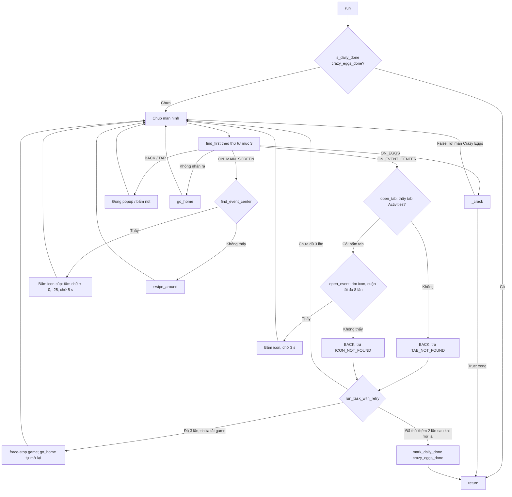
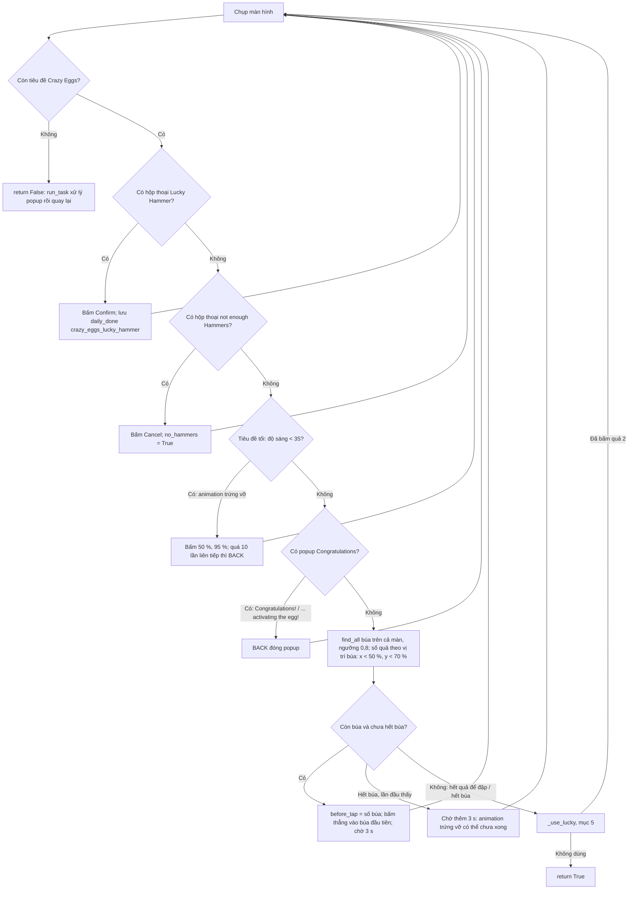
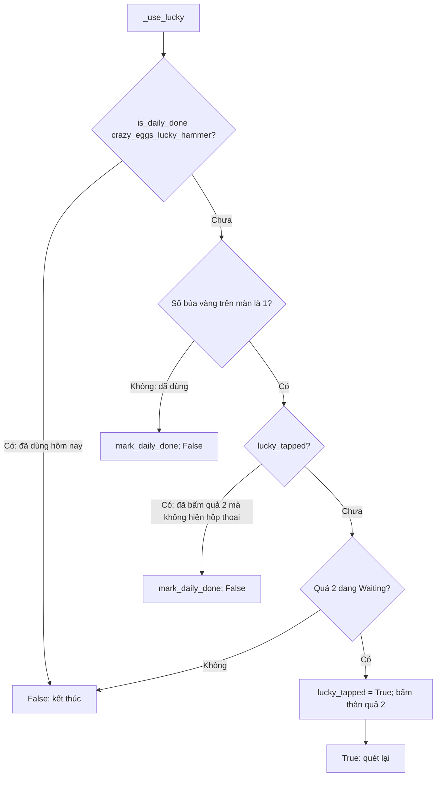

# Flow của Crazy Eggs (đập trứng)

Tài liệu mô tả code hiện tại trong [run.py](run.py), [constants.py](constants.py) và phần dùng chung [../common.py](../common.py). Nhiệm vụ thao tác dựa trên ảnh màn hình: nhận diện màn hình, làm một hành động, rồi quét lại.

## 1. Điểm vào

`run(bot, settings)` là nhiệm vụ của Event Center. **Không phải activity**: nó không có trong `ACTIVITIES`, không có tab UI và không có cột DB riêng. Chỗ nào cần thì gọi `event_center.crazy_eggs.run`. `settings` hiện chưa dùng.

Dùng `bot.is_daily_done` / `bot.mark_daily_done` với 2 key:

- `crazy_eggs_done`: đánh dấu hôm nay xong khi không thấy tab Activities hoặc icon Crazy Eggs, kể cả sau khi thử lại và tắt / mở lại game (mục 2). Đầu mỗi lần gọi, đã có key này thì return ngay, không vào game.
- `crazy_eggs_lucky_hammer`: búa vàng đã dùng hôm nay (mục 5).
 Khi chạy trong worker, thời điểm dùng được lưu vào cột `daily_done` của DB và tính theo mốc reset server.

Mỗi lần gọi tạo một `state` mới: `{"before_tap": None, "lucky_tapped": False, "no_hammers": False}`. `before_tap` là số quả có búa ngay trước lần bấm gần nhất; `lucky_tapped` cho biết đã bấm quả 2 để dùng búa vàng trong lần gọi này chưa; `no_hammers` cho biết đã gặp hộp thoại "You don't have enough Hammers" chưa. Trạng thái này giữ qua các lần rời rồi quay lại màn Crazy Eggs trong cùng một lần gọi, để nhận ra trường hợp hết búa.

Event Crazy Eggs có **vĩnh viễn** (người dùng xác nhận), nên luôn có trong tab Activities. Cuộn hết mà không thấy icon thì là lỗi nhận diện hoặc danh sách đang bị cuộn sẵn, không phải event đã hết.

Dự kiến sau này: chạy kèm các activity khác, cứ mỗi 2 giờ thì đưa lên đầu danh sách activity phụ (Join Monster War vẫn ưu tiên số 1). Phần này **chưa làm**.

## 2. Vòng lặp chính (`event_center.common.run_task`)

**Không thấy tab Activities hoặc icon Crazy Eggs** (VD màn chưa tải xong, nhận diện hụt, danh sách đang bị cuộn sẵn quá icon): `run_task` BACK khỏi Event Center rồi trả `TAB_NOT_FOUND` / `ICON_NOT_FOUND`. `run_task_with_retry` gọi lại `run_task`, tối đa `ATTEMPTS = 3` lần, mỗi lần đi vào lại Event Center. Vẫn không được thì tắt game (`am force-stop`, chờ 3 s): lần quét sau thấy launcher nên `go_home` mở lại game, rồi thử thêm `AFTER_RESTART_ATTEMPTS = 2` lần. Vẫn không được thì lưu `crazy_eggs_done`, bỏ hôm nay.

Mỗi lần `run_task` quét tối đa `MAX_STEPS = 40` màn hình. Quá số đó thì ghi log rồi return. Stop, timeout và boss mới vẫn truyền ra ngoài như mọi lời gọi `bot.*`.

## 3. Thứ tự nhận diện màn hình

Ảnh riêng của nhiệm vụ được xét trước ảnh dùng chung (`common_targets`).

| Ưu tiên | Template | Action | Ghi chú |
| --- | --- | --- | --- |
| 1 | `EventCenter/CrazyEggs/title.png` | ON_EGGS | Tiêu đề "Crazy Eggs", vùng `TITLE_REGION`; khớp 1,00, màn khác <= 0,52 |
| 2 | `EventCenter/competitionTab.png` | ON_EVENT_CENTER | Chữ trên tab "Competition" (lúc nào cũng có), vùng `TAB_REGION` |
| 3 | `exit_images()` | BACK | Popup đóng bằng BACK |
| 4 | `click_images()` | TAP | Nút cứ thấy là bấm |
| 5 | `Server/listActivity.png` | ON_MAIN_SCREEN | Nút "•••" của màn chính |

Màn Event Center được nhận ra bằng tab **Competition**, vì tiêu đề màn đổi theo event đầu danh sách (VD "Pan's Trials") còn tab Competition thì lúc nào cũng có. Sau đó `open_tab` tìm tab Activities (`activitiesTab.png` hoặc `activitiesTabOn.png`, ngưỡng 0,85) để bấm. Hai ảnh tab Activities khớp chéo nhau 0,91 nên không phân biệt: thấy ảnh nào cũng bấm (bấm tab đang chọn không sao).

## 4. Đập trứng (`_crack`)

Màn có 4 quả trứng: hàng trên có quả 1 (trái) và 2 (phải), hàng dưới có quả 3 (trái) và 4 (phải). Quả đập được có nhãn "Scout Cost:" kèm icon búa (`hammer.png`). Quả đang chờ refresh hiện "Waiting: hh:mm:ss" và không có búa. Thời gian refresh sau khi đập do game tự đếm: quả 1 30 phút, quả 2 4 giờ, quả 3 1 giờ, quả 4 2 giờ.

Mỗi quả chứa nhiều vật phẩm. Nhận hết vật phẩm thì trứng vỡ: nhãn thành **"Activated"** (không có búa, không có "Waiting") và quả đó không đập được nữa. Đập thường tự bỏ qua quả này vì nó không có búa. Nếu cả 4 quả đã vỡ thì không còn búa nào, và bot kết thúc.

Lúc trứng vỡ có **animation**: cả màn tối đi, tiêu đề "Crazy Eggs" mờ hẳn. Bot bấm vào (50 %, 95 %) để bỏ qua animation. Sau đó hiện popup thưởng thêm **"Congratulations on activating the egg!"**. Popup này cao hơn popup thường và che gần hết màn hình; bot cũng đóng nó bằng BACK.

- **Nhận animation bằng độ sáng**: template tiêu đề khớp 0,99 cả lúc thường lẫn lúc mờ, vì `TM_CCOEFF_NORMED` bỏ qua độ sáng. Vì vậy bot đo độ sáng trung bình vùng tiêu đề. Màn trứng bình thường 77, popup Congratulations 49, hộp thoại búa vàng 20, animation 14. Ngưỡng `TITLE_DIM_MEAN = 35`. Hộp thoại búa vàng cũng tối, nên được xét trước. Bấm quá `DIM_MAX_TAPS = 10` lần mà màn vẫn tối (lớp phủ tối lạ) thì BACK, để không bị kẹt.

"Hết búa" = `before_tap` có giá trị và số búa hiện tại >= `before_tap`. Lần đầu gặp, bot chờ thêm `EGG_TAP_DELAY` (3 s) rồi quét lại; vẫn vậy mới kết luận hết búa. Lý do: animation trứng vỡ có thể chưa xong, màn hình chưa đổi và popup chưa hiện.

- **Thứ tự 2-3-1-4** (`ORDER`). Bot tìm mọi icon búa (`hammer.png`, tức ảnh 7) trên cả màn hình. Số quả của một búa tính theo vị trí tìm thấy (người dùng chốt): **cột 1** nếu x < `COLUMN_SPLIT` = 50 % chiều rộng màn, **hàng 1** nếu y < `ROW_SPLIT` = 70 % chiều cao màn. Quả 1 = cột 1 hàng 1, 2 = cột 2 hàng 1, 3 = cột 1 hàng 2, 4 = cột 2 hàng 2. Rồi sắp theo `ORDER`. Không dùng chân dung trên quả vì chân dung có hoạt ảnh.
- **Popup "Congratulations!"**: hiện sau mỗi lần đập, liệt kê phần thưởng (khác nhau theo quả) và che hàng trứng trên, trong khi tiêu đề "Crazy Eggs" vẫn còn. Bot nhận popup bằng chữ "Congratulations!" (dùng chung `Event/congratulations.png`), rồi bấm BACK để đóng (popup không tự mất). Chỉ đếm búa khi không có popup, vì lúc popup che hàng trên thì số búa đếm được sẽ sai.
- **Điểm bấm** = **thẳng vào tâm icon búa** tìm được, không cộng trừ gì (bấm vào búa cũng đập được, người dùng xác nhận).
- **Hết búa**: bấm một quả khi không đủ búa thì game hiện hộp thoại **"You don't have enough Hammers. Go get more now?"** (Cancel / Buy). Bot nhận bằng chữ "enough Hammers", bấm **Cancel** (chỉ tìm trong `NOT_ENOUGH_CANCEL_REGION`, vì nút Cancel giống mọi hộp thoại khác; không thấy nút thì BACK), đặt `no_hammers = True` rồi kết thúc đập thường, không chờ thêm. Dự phòng: bấm mà số quả có búa không giảm (so với `before_tap`) cũng coi là hết búa.

## 5. Búa vàng (Lucky Hammer, `_use_lucky`)

Mỗi ngày có 1 búa vàng, đập thêm được 1 lần vào một quả **đang chờ refresh**. Bot dùng nó cho quả 2, sau khi đã hết đập thường.

Búa vàng chỉ là thêm 1 lần đập, nên **làm được thì làm**: lỡ không đập (không xác định được quả 2, bấm trượt nên bị coi là đã dùng...) cũng không sao (người dùng xác nhận). Vì vậy bot không thử lại cho bằng được.

- **Quả 2 đang chờ** = thấy nhãn "Waiting:" (`waiting.png`, chữ không hoạt ảnh) nằm ở vị trí của quả 2 (cột 2, hàng 1, cùng quy tắc 50 % / 70 % như mục 4). Không thấy thì không dùng búa vàng.
- **Luôn ở lần chạy đầu tiên trong ngày**: lúc đó chưa có quả nào vỡ ("Activated"), nên phần tìm quả 2 không cần tính tới nhãn này.
- **Còn búa vàng không**: cạnh icon búa vàng ở góc trên phải màn Crazy Eggs có số búa vàng: "1" là còn, dùng xong thành "0" (icon vẫn còn). Template chỉ cắt chữ số "1", vì nếu cắt cả icon thì chữ số chỉ chiếm phần nhỏ và số "0" vẫn có thể khớp cao. Không thấy số "1" (trong `LUCKY_LEFT_REGION`) thì bot coi như hôm nay đã dùng, lưu `crazy_eggs_lucky_hammer` và không bấm quả 2. Nhờ vậy, búa vàng đã dùng tay trong game cũng được nhận ra.
- **Điểm bấm** = thẳng vào tâm nhãn "Waiting:" của quả 2 (quả đang chờ không có búa).
- **Hộp thoại** "Use the Lucky Hammer to smash an Egg in cooldown, but it can only be used once per day. Confirm use?": bot nhận bằng chữ "Lucky Hammer", bấm **Confirm** (chỉ tìm trong `LUCKY_CONFIRM_REGION`, vì nút Confirm giống mọi hộp thoại khác) rồi `mark_daily_done`. Sau khi Confirm, game hiện popup "Congratulations!" giống hệt đập thường, và bot xử lý y như vậy.
- **Ngày mới**: `is_daily_done` so thời điểm đã lưu với mốc reset server gần nhất (`bot/daily_reset.py`). Qua mốc reset thì búa vàng dùng lại được.
- Bấm quả 2 mà không hiện hộp thoại (VD đã dùng tay trong game): bot coi như đã dùng hôm nay để không bấm lại mãi.

## 6. Ngưỡng đã đo (màn 396x704)

| Template | Trên màn đúng | Màn khác cao nhất | Ngưỡng |
| --- | --- | --- | --- |
| `title.png` | 1,00 | 0,52 | 0,9 (mặc định) |
| `competitionTab.png` | 1,00 (khi đang ở tab Limited lẫn Activities) | 0,55 | 0,9 (mặc định) |
| `activitiesTab.png` / `activitiesTabOn.png` | 1,00 (chéo nhau 0,91) | 0,48 | 0,85 |
| `hammer.png` | 0,84..0,95 (4 quả) | 0,61 (màn trứng đang chờ); không khớp nhầm chỗ nào trên 13 ảnh khi tìm cả màn | 0,8 |
| `waiting.png` | 0,87..1,00 (4 quả) | 0,71 | 0,8 |
| `Event/congratulations.png` | 0,999 (popup sau khi đập); 0,939 (popup trứng vỡ) | 0,45 | 0,9 (mặc định) |
| `activatedRewards.png` | 1,00 (popup trứng vỡ, phần "activating the egg!") | 0,45 | 0,9 (mặc định) |
| `luckyHammer.png` | 1,00 (hộp thoại búa vàng) | 0,62 | 0,9 (mặc định) |
| `confirm.png` | 1,00 | 1,00 (nút Confirm của hộp thoại khác) | 0,9, chỉ tìm khi thấy `luckyHammer.png`, trong vùng nút |
| `luckyHammerOne.png` (chữ số "1") | 1,00 (0,995 khi hộp thoại mở) | số "0" trên màn sáng 0,566 (`12_all_activated.png`); popup che <= 0,66 | 0,9 (mặc định), vùng `LUCKY_LEFT_REGION` |
| Độ sáng vùng tiêu đề | 77 (màn trứng) | animation 14, hộp thoại búa vàng 20, popup 49 | < 35 = animation |
| `icon.png` | 0,934 (ảnh thật `03_activities_crazy_eggs.png`; icon lấp lánh) | 0,555 | 0,8 (`ICON_THRESHOLD`) |
| `notEnoughHammers.png` | 1,00 (hộp thoại hết búa) | 0,60 (hộp thoại búa vàng 0,53) | 0,9 (mặc định) |
| `cancel.png` | 1,00 | 1,00 (nút Cancel của hộp thoại khác) | 0,9, chỉ tìm khi thấy `notEnoughHammers.png`, trong vùng nút |

## 7. Test

[tests/event_center/crazy_eggs/test_flow.py](../../../../tests/event_center/crazy_eggs/test_flow.py), kịch bản cũng ghi trong `.claude/skills/flow-test/flows.md`:

- `test_main_flow`: màn chính → Event Center → tab Activities → Crazy Eggs → đập 2 → popup Congratulations → BACK → đập 3, 1, 4 → búa vàng cho quả 2 → Confirm → popup Congratulations → return; đã lưu `crazy_eggs_lucky_hammer`.
- `test_not_enough_hammers_dialog`: bấm quả 3 khi hết búa → hộp thoại "You don't have enough Hammers" → Cancel → return.
- `test_out_of_hammers`: bấm quả 2 mà màn hình không đổi → hết búa; quả 2 không chờ nên không dùng búa vàng → return.
- `test_all_waiting_lucky_used_returns`: mọi quả đang "Waiting", búa vàng đã dùng hôm nay → return ngay, không bấm gì.
- `test_activated_egg_skipped`: quả 1 đã vỡ ("Activated"), búa vàng đã dùng → chỉ đập quả 3 → animation trứng vỡ (màn tối) → bấm (50 %, 95 %) → popup "Congratulations on activating the egg!" → BACK → return.
- `test_no_lucky_hammer_left`: số búa vàng trên màn không còn là "1" → lưu đã dùng, không bấm quả 2, return.
- `test_no_activities_tab_marks_done`: màn Event Center không có tab Activities → BACK; sau 3 lần thì force-stop game, thử thêm 2 lần → lưu `crazy_eggs_done`, return.
- `test_icon_not_found_restarts_then_marks_done`: tab Activities không có icon (ảnh 03 thật) → mỗi lần cuộn 8 lần rồi BACK; sau 3 lần thì force-stop game, thử thêm 2 lần → lưu `crazy_eggs_done`, return.
- `test_done_today_skips`: đã có `crazy_eggs_done` → return ngay, không thao tác gì.
- `test_lucky_hammer_no_dialog`: bấm quả 2 để dùng búa vàng mà không hiện hộp thoại → lưu đã dùng, return.

Ảnh tổng hợp đang dùng tạm, thay khi có ảnh thật:

- `04_eggs_ready.png?cracked_*`: nhãn của các quả đã đập lấy từ ảnh 05.
- `08_egg_1_activated.png?cracked_3`: nhãn quả 3 lấy từ ảnh 05.
- `02_event_center.png?no_activities_tab`: xoá chữ trên tab Activities.
- `10_egg_breaking.png` là ảnh thật của animation, chèn sau lần đập quả 3 trong `test_activated_egg_skipped`.
- `09_egg_activated_rewards.png` là ảnh thật của popup trứng vỡ, nhưng được chèn sau lần đập quả 3 trong `test_activated_egg_skipped`.
- `06_congratulations.png` là ảnh thật nhưng chụp ở một lần đập khác, được chèn vào sau lần đập quả 2.

## 8. Chưa biết / cần ảnh

Danh sách đầy đủ việc còn lại: [TODO.md](TODO.md).

