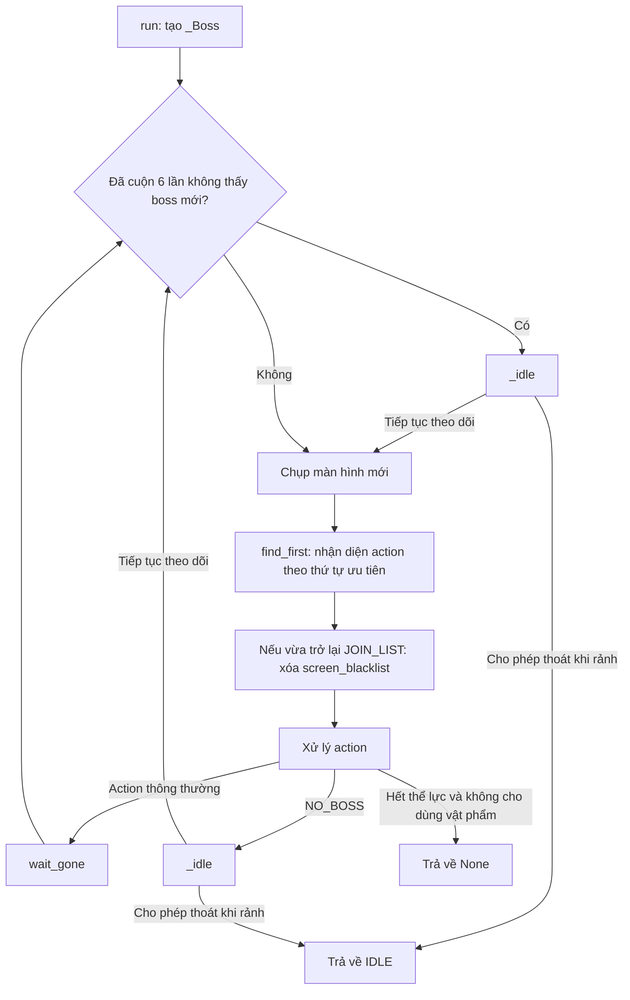
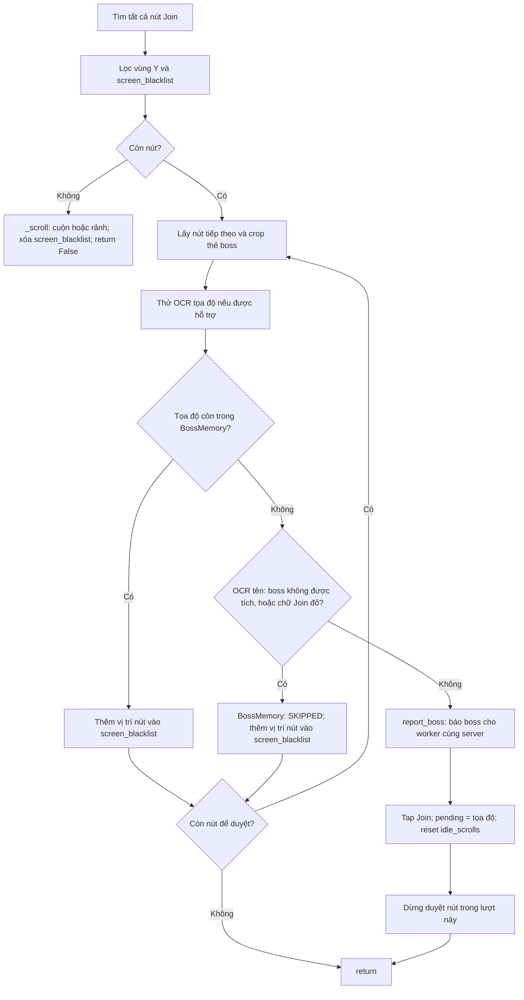

# Flow của Join Monster War

Tài liệu mô tả code hiện tại trong [run.py](run.py) và [constants.py](constants.py). Activity thao tác dựa trên ảnh màn hình: nhận diện trạng thái, chọn hành động, chờ màn hình thay đổi rồi quét lại.

## 1. Điểm vào và cấu hình

Worker gọi `run(bot, settings)`, tạo một đối tượng `_Boss` mới rồi chạy `_Boss.run()`.

| Cấu hình | Cách sử dụng |
| --- | --- |
| `troop` | Danh sách preset quân (vd `["Troop 1", "Troop 3"]`, vẫn nhận chuỗi đơn kiểu cũ); lấy số ở cuối mỗi chuỗi, xoay vòng qua từng preset mỗi lần march; nếu không đọc được thì dùng 1. |
| `use_stamina` | Chỉ `ALL` hoặc `100` cho phép xử lý bổ sung thể lực; giá trị khác khiến activity kết thúc khi gặp hết thể lực. |
| `selected_bosses` | Boss được tích ở tab (`[{category_key, name, levels}]`). Chỉ Join boss có tên trong danh sách; boss có cấp chỉ Join khi cấp đọc được nằm trong `levels`. Không có key này (cấu hình cũ) thì không lọc theo tên. |
| `exit_when_idle` | Mặc định False. Worker bật True khi còn activity phụ để Join Boss trả quyền điều khiển lúc rảnh. |

Khi module được import, code kiểm tra template một lần:

- `CAN_READ_COORDS`: có ảnh LOCATION thì mới thử OCR tọa độ.
- `CAN_SELECT_GENERAL`: phải có đủ bốn ảnh chọn tướng thì mới chạy bước chọn tướng.

Mỗi lần gọi activity sẽ khởi tạo lại `screen_blacklist`, bộ đếm cuộn và trạng thái nhận diện trước đó. `BossMemory` (toạ độ boss đã tham gia / bỏ qua, mục 5) gắn với BotContext nên **không** bị reset: nó còn qua các lần worker gọi lại Join Boss và chỉ mất khi bấm Stop. Dữ liệu BossBoard dùng chung nằm ngoài cả hai.

## 2. Vòng lặp chính



Vòng lặp không có giới hạn số lần chạy. Stop và các exception từ BotContext truyền ra cho worker xử lý.

## 3. Thứ tự nhận diện màn hình

`_targets()` đưa các template cho `find_first()` theo thứ tự sau. Thứ tự quan trọng vì một màn hình có thể khớp nhiều template.

| Ưu tiên | Template hoặc nhóm | Action |
| --- | --- | --- |
| 1 | `click/lencap.png` | TAP |
| 2 | `JoinBoss/hettheluc.png` | OUT_OF_STAMINA |
| 3 | MARCH | MARCH_SCREEN |
| 4 | JOIN | JOIN_LIST |
| 5 | JOINED_BUTTON | JOINED |
| 6 | PVP_WAR | NO_BOSS |
| 7 | WAR_TAB | SCROLL |
| 8 | `Items/outLM.png` | LEAVE_ALLIANCE_POPUP |
| 9 | `JoinBoss/chientranh.png` | TAP |
| 10 | Các ảnh từ `exit_images()` | BACK |
| 11 | Các ảnh từ `click_images()` | TAP |
| 12 | LISTBOSS | TAP |
| 13 | ALLIANCE_ICON | NO_BOSS |

JOIN và JOINED được xét trước PVP_WAR. LISTBOSS được xét trước ALLIANCE_ICON. Vì vậy NO_BOSS là kết luận từ các ảnh khớp theo thứ tự trên, không phải một truy vấn trực tiếp tới dữ liệu game.

Các template có trong `REGIONS` chỉ được tìm trong vùng phần trăm màn hình quy định ở constants.py.

### Ô "War" trên danh sách War

Khi đang ở danh sách War (JOIN_LIST / JOINED / SCROLL, hoặc NO_BOSS mà thấy tab PvP War), nếu ô **"War"** (rally đánh người chơi, cạnh ô "Monster War") đang tích thì bot bấm bỏ tích **trước khi xét boss**, rồi chờ tối đa 3 giây cho dấu tích mất; ảnh xác nhận được dùng cho vòng lặp kế tiếp.

- Nhận diện bằng ảnh mẫu `JoinBoss/warTicked.png` (ô hình thoi có dấu tích, cắt từ ảnh chụp thật), chỉ tìm trong `REGIONS[WAR_TICKED]` vì ô "Monster War" giống hệt (khớp 0,92). Điểm khớp: đang tích 1,00; đã bỏ tích ~0,67; ngưỡng 0,9. Bấm vào đúng vị trí tìm thấy.
- Mỗi lượt chạy bấm tối đa `WAR_UNTICK_TRIES = 3` lần, để game chậm không làm bot bấm qua bấm lại (tích lại).
- Ô "Monster War" không bị đụng tới.

## 4. Xử lý từng action

| Action | Hành vi |
| --- | --- |
| OUT_OF_STAMINA | Nếu không cho dùng vật phẩm thì trả về None; nếu cho phép thì tap, chờ trạng thái cũ biến mất và gọi `_use_stamina()`. |
| NO_BOSS | Gọi `_idle()`; trả IDLE hoặc chờ rồi quét lại, bỏ qua `wait_gone` cuối vòng. |
| MARCH_SCREEN | Gọi `_march(screen, pos)`. |
| JOIN_LIST | Gọi `_join(screen)`. Không tap Join nào (bỏ qua hết, hoặc đã cuộn) thì bỏ qua `wait_gone` cuối vòng. |
| SCROLL / JOINED | Gọi `_scroll()`, bỏ qua `wait_gone` cuối vòng. |
| TAP | Tap vào vị trí nhận diện. |
| BACK | Gửi Back. |
| LEAVE_ALLIANCE_POPUP | Tap tại góc trên trái template cộng `(40, 40)`, chờ rồi Back. |
| Không nhận diện được | Chờ 1 giây, chụp lại màn hình rồi gọi `go_home()`. |

Sau các nhánh không return/continue, code gọi `wait_gone()` với action và vị trí cũ trước khi bắt đầu vòng tiếp theo. `wait_gone` chờ tới 10 giây cho ảnh vừa nhận diện biến mất, nên chỉ dùng khi bot đã tap / back làm màn hình đổi; lượt không thao tác (bỏ qua hết boss) hoặc vừa cuộn thì không gọi.

## 5. Chọn boss: `_join()`



Chi tiết bộ lọc:

- Tìm JOIN với threshold 0,8 trong `REGIONS[JOIN]`, lấy góc trên trái nút.
- Chỉ giữ nút có `262 < y < 615`.
- Loại nút gần một vị trí trong `screen_blacklist`: chênh lệch cả x và y đều nhỏ hơn 10 pixel.
- Crop thẻ boss tại `(x - 90, y - 150)` với kích thước `160 × 190`.
- Nếu tìm được LOCATION, OCR vùng `80 × 15` ngay bên phải icon để lấy tọa độ.
- OCR nhãn tên "(Boss) <tên>" hoặc "<tier> <tên>" tại `(x - 95, y - 90)`, kích thước `168 × 30` ([read_boss_name.py](../../ocr/read_boss_name.py), mẫu chữ trong `Images/OCR/Name/`). Tên dài xuống 2 dòng ("(Boss) Skeleton" / "Dragon") được tách theo hàng trống, đọc từng dòng rồi ghép bằng dấu cách. Sau đó khớp với `ui/tabs/boss.json` ([boss_names.py](boss_names.py)): `?` (mảnh chưa có mẫu) được coi là 1–3 chữ bất kỳ, ngoài ra so gần đúng (difflib ≥ 0,75), kể cả khi game đảo thứ tự từ ("Senior Bayar Knight").
- Cấp của boss có `levels` trong boss.json: có chữ tier trong tên (Junior, Senior...) thì tra bảng tier **của chính boss đó**; không có tier thì OCR lực của boss tại `(x - 10, y - 180)`, `65 × 20` ([read_power.py](../../ocr/read_power.py), mẫu trong `Images/OCR/Power/`) và chọn cấp có `power` gần nhất (lệch tối đa ×1,3). Boss thường, và boss mà boss.json không cho tier lẫn power ở cấp nào (VD Aglaope), chỉ cần kiểm tra tên.
- Tên không nhận ra, boss không được tích, cấp đọc được mà không được tích, hoặc boss có dữ liệu cấp mà không xác định được cấp = không tham gia. Riêng tên có cả bản không cấp (Nian ở Boss Standard) thì không xác định được cấp vẫn Join nếu bản không cấp được tích. Mỗi thẻ được ghi log `Boss (x, y): '<chữ OCR>' [power N] -> <tên> [lv N]: join / không tham gia`.
- Nhận diện chữ đỏ bằng vùng crop dưới nút Join: có hơn 5 pixel thỏa `R > 160`, `G < 110`, `B < 110` thì bỏ qua.

Mỗi lần `_join()` chỉ tap tối đa một nút Join. Nếu các nút đều bị bỏ qua, hàm trở về vòng quét; lần sau các nút đã ghi nhớ sẽ bị lọc.

### BossMemory — boss đã tham gia / bỏ qua

[boss_memory.py](boss_memory.py) lưu `tọa độ -> (trạng thái, hết hạn)` riêng cho từng giả lập, trong bộ nhớ:

| Trạng thái | Khi nào được ghi |
| --- | --- |
| `SKIPPED` | Boss không được tích ở tab (hoặc không nhận ra tên), hoặc nút Join chữ đỏ. |
| `JOINED` | Trong `_march()`, khi màn hình March đóng lại sau khi tap hành quân. Tap Join chỉ đặt `pending`; mọi nhánh Back của `_march()` (không phải boss, không chọn được quân, March không đóng) bỏ `pending`, nên boss đó được thử lại. |

- Mỗi tọa độ hết hạn sau 6 phút (`TTL`), sau đó boss ở tọa độ đó được xét lại như mới.
- Thấy lại tọa độ còn hạn: không OCR tên, không kiểm tra chữ đỏ, không Join, chỉ thêm vị trí nút vào `screen_blacklist`.
- Khóa là tọa độ boss, nên hai rally trên cùng một con boss được tính là một: join một rally thì rally còn lại bị bỏ qua.
- Không đọc được tọa độ (OCR `None`) thì không lưu được; nút chỉ bị lọc bằng `screen_blacklist` trong màn hình hiện tại.

## 6. Báo boss cho các giả lập cùng server

Ngay trước khi tap Join, activity gọi:

```python
bot.report_boss(coords)
```

Flow nối với worker:

```text
_Boss._join()
  → BotContext.report_boss(coords)
  → BotWorker._report_boss(coords)
  → BossBoard.publish(serial, server, coords)
  → Bật event của các worker đã đăng ký cùng server, trừ worker nguồn
  → Worker đang chạy activity phụ gặp ctx.check()
  → Ném BossAvailable và chuyển sang Join Boss
```

- Worker phải chọn Join Monster War để đăng ký nhận thông báo.
- Server rỗng không được phát thông báo; hiện chỉ lọc server, không lọc liên minh.
- BossBoard chống trùng theo `(server, tọa độ)` trong 120 giây. Nếu không đọc được tọa độ, các báo cáo không rõ tọa độ cùng server được gộp trong 10 giây.
- Thông báo xảy ra trước bước xác nhận BOSS_MONSTER ở màn hình March và trước khi hành quân thành công.
- Worker nhận chỉ được đánh thức để tự quét danh sách Join; không nhận chỉ thị chọn đúng tọa độ được báo.
- Join Boss đang chạy không bị ngắt bởi thông báo boss. Chỉ cửa sổ chạy activity phụ của scheduler bật kiểu ngắt này.

Chi tiết triển khai nằm ở [boss_board.py](../../worker/boss_board.py) và [bot_worker.py](../../worker/bot_worker.py).

## 7. Hành quân: `_march()`

1. Kiểm tra BOSS_MONSTER trong vùng quy định. Không thấy thì Back và trả về vòng chính.
2. Lấy preset kế tiếp trong danh sách `troop` (xoay vòng), thử chọn tối đa 5 lần: tap tại `(troop × 11%, 11%)`, chờ 0,5 giây, tìm TROOP_CHECK.
3. Nếu cả 5 lần không thấy TROOP_CHECK, Back và trả về.
4. Nếu đủ template chọn tướng, gọi `_select_general()`.
5. Tìm lại MARCH; tap vị trí mới nếu có, nếu không dùng vị trí MARCH đã nhận diện ở vòng chính.
6. Tối đa 5 lần, mỗi lần chờ 0,8 giây và kiểm tra TROOP_CHECK. Nếu ảnh này biến mất thì ghi tọa độ boss vừa Join vào BossMemory là `JOINED` rồi trả về.
7. Nếu vẫn còn TROOP_CHECK sau các lần chờ, Back.

Việc TROOP_CHECK biến mất được dùng làm dấu hiệu thoát màn hình March; code không đọc kết quả từ server game để xác nhận rally đã tham gia thành công.

### Chọn tướng: `_select_general()`

Chạy tối đa 2 lượt:

1. Tìm SELECT_GENERAL với threshold 0,7; không thấy thì return.
2. Tap, chờ 1,5 giây.
3. Nếu thấy CHOOSE_DEVELOPMENT thì tap, chờ 1 giây; nếu tiếp tục thấy CHOOSE_FAVORITE thì tap và chờ 1 giây.
4. Tìm SELECT; không thấy thì return, thấy thì tap.
5. Chờ tối đa 5 lần, mỗi lần 0,8 giây, để tìm lại MARCH.

Hàm không trả cờ thành công/thất bại. Khi nó trả về, `_march()` vẫn tiếp tục bước tìm và tap MARCH.

## 8. Bổ sung thể lực: `_use_stamina()`

1. Tìm các STAMINA_ITEM và sắp xếp theo tọa độ y.
2. Nếu có vật phẩm, tap vật phẩm trên cùng rồi chờ 2 giây.
3. Tìm USE_STAMINA; nếu không thấy thì return ngay.
4. Với `ALL`, tap hai lần tại `(28,9%, 71,6%)`. Với `100`, nếu tìm được PLUS thì tap hai lần tại vị trí offset bên phải ảnh PLUS.
5. Chờ 1 giây rồi tap USE_STAMINA.
6. Nếu không có vật phẩm, gửi Back.
7. Trừ nhánh return sớm ở bước 3, cuối hàm luôn chờ 1 giây rồi Back.

Tên cấu hình ALL/100 được chuyển thành các thao tác UI trên; hàm không OCR lượng thể lực thực tế đã sử dụng.

## 9. Cuộn danh sách và trạng thái rảnh

`_scroll(screen)`:

- Nếu đang ở đầu danh sách (`swipe == 0`) và danh sách đã hiện hết thì **không cuộn**: đặt `idle_scrolls = 4` để vòng lặp kế tiếp gọi `_idle()` ngay. Mọi boss trên màn hình đã được xét và đều không tham gia (hoặc chỉ còn Joined).
  - "Hiện hết" = dải `LIST_END_REGION` (ngay trên nút Battle Logs / Auto-Join) chỉ có nền tối: pixel sáng nhất < 80. Còn thẻ bị che thì dải này có chữ / viền sáng tới ~250.
  - `swipe != 0` (đang giữa chu kỳ trên danh sách dài) thì vẫn cuộn tiếp để quay về đầu danh sách.
- Ngược lại tăng `idle_scrolls`, vuốt theo chu kỳ 4 bước, chờ 0,5 giây cho danh sách dừng trôi rồi **chụp ảnh luôn** (`next_screen`) cho vòng lặp kế tiếp, không qua `wait_gone`:

| Giá trị `swipe` | Thao tác |
| --- | --- |
| 0, 1, 2 | Vuốt xuống: từ `(50%, 65%)` tới `(50%, 40%)`, thời lượng 0,8 giây. |
| 3, 4, 5 | Vuốt lên: từ `(50%, 40%)` tới `(50%, 65%)`, thời lượng 0,8 giây. |

Sau mỗi lần vuốt, `swipe = (swipe + 1) % 6` (`SCROLLS_EACH_WAY = 3`: 3 lần xuống rồi 3 lần lên).

`_idle()` được gọi khi nhận diện NO_BOSS hoặc khi đầu vòng lặp thấy `idle_scrolls >= 6` (`IDLE_SCROLLS`: cuộn hết một chu kỳ mà không thấy boss mới). Nó luôn reset `idle_scrolls` về 0:

- `exit_when_idle=True`: trả True để vòng chính trả về chuỗi `IDLE`.
- `exit_when_idle=False`: chờ 5 giây rồi trả False để tiếp tục quét.

`idle_scrolls` được reset về 0 khi thấy một **boss mới** (đọc được tọa độ và tọa độ chưa có trong BossMemory, dù sau đó Join hay không tham gia) và khi tap Join. Thẻ không đọc được tọa độ không reset, để một thẻ OCR lỗi không làm bot cuộn mãi. Chu kỳ xuống / lên (`swipe`) không bị reset, vẫn chạy tiếp.

## 10. Kết thúc và quan hệ với worker

| Kết quả | Ý nghĩa đối với worker |
| --- | --- |
| `IDLE` | Join Boss đang rảnh; trong chế độ ưu tiên boss, worker cho activity phụ chạy tối đa 120 giây hoặc tới khi có thông báo boss mới. |
| `None` | Trong flow hiện tại, xảy ra khi hết thể lực và không cho bổ sung; worker chạy nốt activity phụ còn lại rồi kết thúc chế độ ưu tiên. |
| `StopRequested` | Truyền ra worker để dừng bot. |
| Exception khác | Truyền ra worker; worker xử lý theo loại exception và cập nhật trạng thái. |

Activity không tự bắt exception và không tạo thread mới. Các thao tác qua BotContext cung cấp điểm kiểm tra ngắt; lời gọi thiết bị đang bị chặn phải kết thúc trước khi code kiểm tra tiếp được.

Khi worker gọi lại Join Boss, một `_Boss` mới được tạo. `screen_blacklist` và bộ đếm được reset; `BossMemory` giữ nguyên (tới khi hết hạn hoặc Stop); bản ghi chống trùng trong BossBoard vẫn tồn tại đến khi hết hạn và được dọn ở lần publish tiếp theo.
