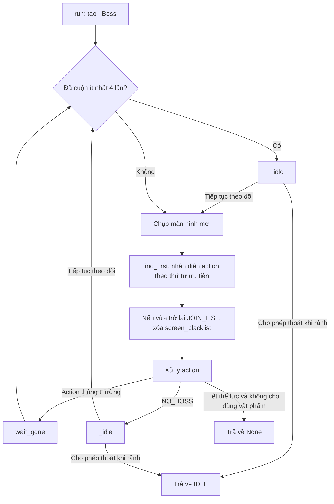
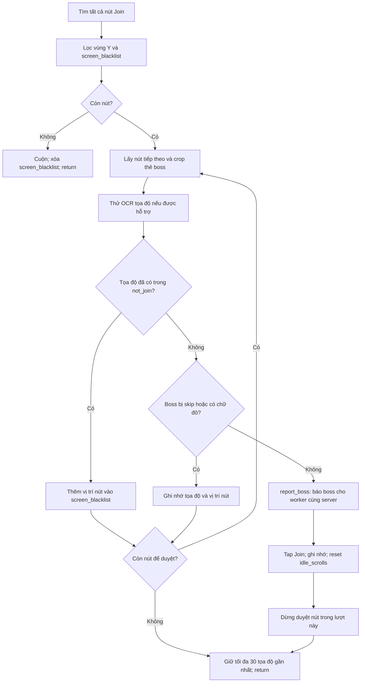

# Flow của Join Monster War

Tài liệu mô tả code hiện tại trong [run.py](run.py) và [constants.py](constants.py). Activity thao tác dựa trên ảnh màn hình: nhận diện trạng thái, chọn hành động, chờ màn hình thay đổi rồi quét lại.

## 1. Điểm vào và cấu hình

Worker gọi `run(bot, settings)`, tạo một đối tượng `_Boss` mới rồi chạy `_Boss.run()`.

| Cấu hình | Cách sử dụng |
| --- | --- |
| `troop` | Danh sách preset quân (vd `["Troop 1", "Troop 3"]`, vẫn nhận chuỗi đơn kiểu cũ); lấy số ở cuối mỗi chuỗi, xoay vòng qua từng preset mỗi lần march; nếu không đọc được thì dùng 1. |
| `use_stamina` | Chỉ `ALL` hoặc `100` cho phép xử lý bổ sung thể lực; giá trị khác khiến activity kết thúc khi gặp hết thể lực. |
| `skip_cerberus` | Nếu bật, bỏ qua thẻ boss nhận diện được bằng ảnh Cerberus. |
| `exit_when_idle` | Mặc định False. Worker bật True khi còn activity phụ để Join Boss trả quyền điều khiển lúc rảnh. |

Khi module được import, code kiểm tra template một lần:

- `CAN_READ_COORDS`: có ảnh LOCATION thì mới thử OCR tọa độ.
- `CAN_SELECT_GENERAL`: phải có đủ bốn ảnh chọn tướng thì mới chạy bước chọn tướng.

Mỗi lần gọi activity sẽ khởi tạo lại `not_join`, `screen_blacklist`, bộ đếm cuộn và trạng thái nhận diện trước đó. Dữ liệu BossBoard dùng chung nằm ngoài đối tượng này.

## 2. Vòng lặp chính



Vòng lặp không có giới hạn số lần chạy. Stop và các exception từ BotContext truyền ra cho worker xử lý.

## 3. Thứ tự nhận diện màn hình

`_targets()` đưa các template cho `find_first()` theo thứ tự sau. Thứ tự quan trọng vì một màn hình có thể khớp nhiều template.

| Ưu tiên | Template hoặc nhóm | Action |
| --- | --- | --- |
| 1 | `click/lencap.png` | TAP |
| 2 | `JoinBoss/hettheluc.png` | OUT_OF_STAMINA |
| 3 | MARCH | MARCH_SCREEN |
| 4 | JOIN | JOIN_LIST |
| 5 | JOINED_BUTTON | JOINED |
| 6 | PVP_WAR | NO_BOSS |
| 7 | WAR_TAB | SCROLL |
| 8 | `Items/outLM.png` | LEAVE_ALLIANCE_POPUP |
| 9 | `JoinBoss/chientranh.png` | TAP |
| 10 | Các ảnh từ `exit_images()` | BACK |
| 11 | Các ảnh từ `click_images()` | TAP |
| 12 | LISTBOSS | TAP |
| 13 | ALLIANCE_ICON | NO_BOSS |

JOIN và JOINED được xét trước PVP_WAR. LISTBOSS được xét trước ALLIANCE_ICON. Vì vậy NO_BOSS là kết luận từ các ảnh khớp theo thứ tự trên, không phải một truy vấn trực tiếp tới dữ liệu game.

Các template có trong `REGIONS` chỉ được tìm trong vùng phần trăm màn hình quy định ở constants.py.

## 4. Xử lý từng action

| Action | Hành vi |
| --- | --- |
| OUT_OF_STAMINA | Nếu không cho dùng vật phẩm thì trả về None; nếu cho phép thì tap, chờ trạng thái cũ biến mất và gọi `_use_stamina()`. |
| NO_BOSS | Gọi `_idle()`; trả IDLE hoặc chờ rồi quét lại, bỏ qua `wait_gone` cuối vòng. |
| MARCH_SCREEN | Gọi `_march(screen, pos)`. |
| JOIN_LIST | Gọi `_join(screen)`. |
| SCROLL / JOINED | Gọi `_scroll()`. Với JOINED, chỉ giữ các tọa độ trong `not_join` có cả x và y nhỏ hơn 800. |
| TAP | Tap vào vị trí nhận diện. |
| BACK | Gửi Back. |
| LEAVE_ALLIANCE_POPUP | Tap tại góc trên trái template cộng `(40, 40)`, chờ rồi Back. |
| Không nhận diện được | Chờ 1 giây, chụp lại màn hình rồi gọi `go_home()`. |

Sau các nhánh không return/continue, code gọi `wait_gone()` với action và vị trí cũ trước khi bắt đầu vòng tiếp theo.

## 5. Chọn boss: `_join()`



Chi tiết bộ lọc:

- Tìm JOIN với threshold 0,8 trong `REGIONS[JOIN]`, lấy góc trên trái nút.
- Chỉ giữ nút có `262 < y < 615`.
- Loại nút gần một vị trí trong `screen_blacklist`: chênh lệch cả x và y đều nhỏ hơn 10 pixel.
- Crop thẻ boss tại `(x - 90, y - 150)` với kích thước `160 × 190`.
- Nếu tìm được LOCATION, OCR vùng `80 × 15` ngay bên phải icon để lấy tọa độ.
- Tìm ảnh boss bị skip với threshold 0,7.
- Nhận diện chữ đỏ bằng vùng crop dưới nút Join: có hơn 5 pixel thỏa `R > 160`, `G < 110`, `B < 110` thì bỏ qua.

Mỗi lần `_join()` chỉ tap tối đa một nút Join. Nếu các nút đều bị bỏ qua, hàm trở về vòng quét; lần sau các nút đã ghi nhớ sẽ bị lọc.

`not_join` nghĩa là tọa độ đã xử lý, gồm cả boss bị bỏ qua và boss đã tap Join. Nó không phải danh sách xác nhận tham gia thành công.

## 6. Báo boss cho các giả lập cùng server

Ngay trước khi tap Join, activity gọi:

```python
bot.report_boss(coords)
```

Flow nối với worker:

```text
_Boss._join()
  → BotContext.report_boss(coords)
  → BotWorker._report_boss(coords)
  → BossBoard.publish(serial, server, coords)
  → Bật event của các worker đã đăng ký cùng server, trừ worker nguồn
  → Worker đang chạy activity phụ gặp ctx.check()
  → Ném BossAvailable và chuyển sang Join Boss
```

- Worker phải chọn Join Monster War để đăng ký nhận thông báo.
- Server rỗng không được phát thông báo; hiện chỉ lọc server, không lọc liên minh.
- BossBoard chống trùng theo `(server, tọa độ)` trong 120 giây. Nếu không đọc được tọa độ, các báo cáo không rõ tọa độ cùng server được gộp trong 10 giây.
- Thông báo xảy ra trước bước xác nhận BOSS_MONSTER ở màn hình March và trước khi hành quân thành công.
- Worker nhận chỉ được đánh thức để tự quét danh sách Join; không nhận chỉ thị chọn đúng tọa độ được báo.
- Join Boss đang chạy không bị ngắt bởi thông báo boss. Chỉ cửa sổ chạy activity phụ của scheduler bật kiểu ngắt này.

Chi tiết triển khai nằm ở [boss_board.py](../../worker/boss_board.py) và [bot_worker.py](../../worker/bot_worker.py).

## 7. Hành quân: `_march()`

1. Kiểm tra BOSS_MONSTER trong vùng quy định. Không thấy thì Back và trả về vòng chính.
2. Lấy preset kế tiếp trong danh sách `troop` (xoay vòng), thử chọn tối đa 5 lần: tap tại `(troop × 11%, 11%)`, chờ 0,5 giây, tìm TROOP_CHECK.
3. Nếu cả 5 lần không thấy TROOP_CHECK, Back và trả về.
4. Nếu đủ template chọn tướng, gọi `_select_general()`.
5. Tìm lại MARCH; tap vị trí mới nếu có, nếu không dùng vị trí MARCH đã nhận diện ở vòng chính.
6. Tối đa 5 lần, mỗi lần chờ 0,8 giây và kiểm tra TROOP_CHECK. Nếu ảnh này biến mất thì trả về.
7. Nếu vẫn còn TROOP_CHECK sau các lần chờ, Back.

Việc TROOP_CHECK biến mất được dùng làm dấu hiệu thoát màn hình March; code không đọc kết quả từ server game để xác nhận rally đã tham gia thành công.

### Chọn tướng: `_select_general()`

Chạy tối đa 2 lượt:

1. Tìm SELECT_GENERAL với threshold 0,7; không thấy thì return.
2. Tap, chờ 1,5 giây.
3. Nếu thấy CHOOSE_DEVELOPMENT thì tap, chờ 1 giây; nếu tiếp tục thấy CHOOSE_FAVORITE thì tap và chờ 1 giây.
4. Tìm SELECT; không thấy thì return, thấy thì tap.
5. Chờ tối đa 5 lần, mỗi lần 0,8 giây, để tìm lại MARCH.

Hàm không trả cờ thành công/thất bại. Khi nó trả về, `_march()` vẫn tiếp tục bước tìm và tap MARCH.

## 8. Bổ sung thể lực: `_use_stamina()`

1. Tìm các STAMINA_ITEM và sắp xếp theo tọa độ y.
2. Nếu có vật phẩm, tap vật phẩm trên cùng rồi chờ 2 giây.
3. Tìm USE_STAMINA; nếu không thấy thì return ngay.
4. Với `ALL`, tap hai lần tại `(28,9%, 71,6%)`. Với `100`, nếu tìm được PLUS thì tap hai lần tại vị trí offset bên phải ảnh PLUS.
5. Chờ 1 giây rồi tap USE_STAMINA.
6. Nếu không có vật phẩm, gửi Back.
7. Trừ nhánh return sớm ở bước 3, cuối hàm luôn chờ 1 giây rồi Back.

Tên cấu hình ALL/100 được chuyển thành các thao tác UI trên; hàm không OCR lượng thể lực thực tế đã sử dụng.

## 9. Cuộn danh sách và trạng thái rảnh

`_scroll()` tăng `idle_scrolls` và chạy chu kỳ 4 bước:

| Giá trị `swipe` | Thao tác |
| --- | --- |
| 0, 1 | Vuốt từ `(50%, 65%)` tới `(50%, 40%)`, thời lượng 0,8 giây. |
| 2, 3 | Vuốt ngược từ `(50%, 40%)` tới `(50%, 65%)`, thời lượng 0,8 giây. |

Sau mỗi lần vuốt, `swipe = (swipe + 1) % 4`.

`_idle()` được gọi khi nhận diện NO_BOSS hoặc khi đầu vòng lặp thấy `idle_scrolls >= 4`. Nó luôn reset `idle_scrolls` về 0:

- `exit_when_idle=True`: trả True để vòng chính trả về chuỗi `IDLE`.
- `exit_when_idle=False`: chờ 5 giây rồi trả False để tiếp tục quét.

Tap một nút Join cũng reset `idle_scrolls` về 0. Bộ đếm này phản ánh các lần cuộn kể từ lần reset, không xác nhận đã đọc hết mọi rally trên server.

## 10. Kết thúc và quan hệ với worker

| Kết quả | Ý nghĩa đối với worker |
| --- | --- |
| `IDLE` | Join Boss đang rảnh; trong chế độ ưu tiên boss, worker cho activity phụ chạy tối đa 120 giây hoặc tới khi có thông báo boss mới. |
| `None` | Trong flow hiện tại, xảy ra khi hết thể lực và không cho bổ sung; worker chạy nốt activity phụ còn lại rồi kết thúc chế độ ưu tiên. |
| `StopRequested` | Truyền ra worker để dừng bot. |
| Exception khác | Truyền ra worker; worker xử lý theo loại exception và cập nhật trạng thái. |

Activity không tự bắt exception và không tạo thread mới. Các thao tác qua BotContext cung cấp điểm kiểm tra ngắt; lời gọi thiết bị đang bị chặn phải kết thúc trước khi code kiểm tra tiếp được.

Khi worker gọi lại Join Boss, một `_Boss` mới được tạo. Các danh sách ghi nhớ cục bộ được reset, còn bản ghi chống trùng trong BossBoard vẫn tồn tại đến khi hết hạn và được dọn ở lần publish tiếp theo.
