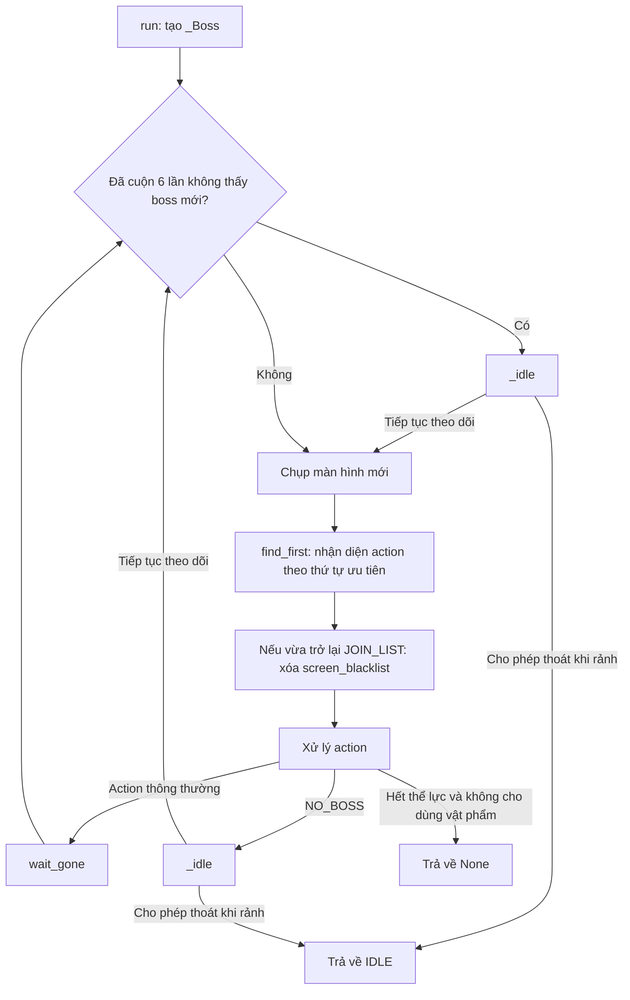
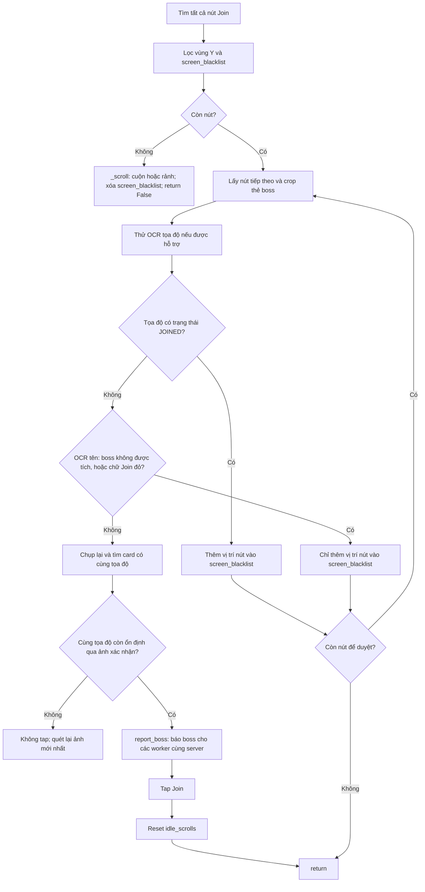

# Flow của Join Monster War

Tài liệu mô tả code hiện tại trong [run.py](run.py) và [constants.py](constants.py). Activity thao tác dựa trên ảnh màn hình: nhận diện trạng thái, chọn hành động, chờ màn hình thay đổi rồi quét lại.

## 1. Điểm vào và cấu hình

Worker gọi `run(bot, settings)`, tạo một đối tượng `_Boss` mới rồi chạy `_Boss.run()`.

| Cấu hình | Cách sử dụng |
| --- | --- |
| `troop` | Danh sách preset quân (vd `["Troop 1", "Troop 3"]`, vẫn nhận chuỗi đơn kiểu cũ); lấy số ở cuối mỗi chuỗi, xoay vòng qua từng preset mỗi lần march; nếu không đọc được thì dùng 1. |
| `use_stamina` | Chỉ `ALL`, `100`, `200`, `300`, `400`, `500` cho phép xử lý bổ sung thể lực; giá trị khác khiến activity kết thúc khi gặp hết thể lực. |
| `selected_bosses` | Boss được tích ở tab (`[{category_key, name, levels}]`). Chỉ Join boss có tên trong danh sách; boss có cấp chỉ Join khi cấp đọc được nằm trong `levels`. Không có key này (cấu hình cũ) thì không lọc theo tên. |
| `exit_when_idle` | Mặc định False. Worker bật True khi còn activity phụ để Join Boss trả quyền điều khiển lúc rảnh. |

Khi module được import, code kiểm tra template một lần:

- `CAN_READ_COORDS`: có ảnh LOCATION thì mới thử OCR tọa độ.
- `CAN_SELECT_GENERAL`: phải có đủ bốn ảnh chọn tướng thì mới chạy bước chọn tướng.

Mỗi lần gọi activity sẽ khởi tạo lại `screen_blacklist`, bộ đếm cuộn và trạng thái nhận diện trước đó. `BossMemory` chỉ chặn dài hạn các tọa độ đã xác nhận `JOINED`; boss không được chọn chỉ bị blacklist trên màn hình hiện tại. BossMemory gắn với BotContext nên còn qua các lần worker gọi lại Join Boss và mất khi bấm Stop. Dữ liệu BossBoard dùng chung nằm ngoài cả hai.

## 2. Vòng lặp chính



Vòng lặp không có giới hạn số lần chạy. Stop và các exception từ BotContext truyền ra cho worker xử lý.

## 3. Thứ tự nhận diện màn hình

`_targets()` đưa các template cho `find_first()` theo thứ tự sau. Thứ tự quan trọng vì một màn hình có thể khớp nhiều template.

| Ưu tiên | Template hoặc nhóm | Action |
| --- | --- | --- |
| 1 | `click/lencap.png` | TAP |
| 2 | `JoinBoss/hettheluc.png` | OUT_OF_STAMINA |
| 3 | MARCH | MARCH_SCREEN |
| 4 | JOIN | JOIN_LIST |
| 5 | JOINED_BUTTON | JOINED |
| 6 | PVP_WAR | NO_BOSS |
| 7 | WAR_TAB | SCROLL |
| 8 | `Items/outLM.png` | LEAVE_ALLIANCE_POPUP |
| 9 | `JoinBoss/chientranh.png` | TAP |
| 10 | Các ảnh từ `exit_images()` | BACK |
| 11 | Các ảnh từ `click_images()` | TAP |
| 12 | LISTBOSS | TAP |
| 13 | ALLIANCE_ICON | NO_BOSS |

JOIN và JOINED được xét trước PVP_WAR. LISTBOSS được xét trước ALLIANCE_ICON. Vì vậy NO_BOSS là kết luận từ các ảnh khớp theo thứ tự trên, không phải một truy vấn trực tiếp tới dữ liệu game.

Các template có trong `REGIONS` chỉ được tìm trong vùng phần trăm màn hình quy định ở constants.py.

### Ô "War" trên danh sách War

Khi đang ở danh sách War (JOIN_LIST / JOINED / SCROLL, hoặc NO_BOSS mà thấy tab PvP War), nếu ô **"War"** (rally đánh người chơi, cạnh ô "Monster War") đang tích thì bot bấm bỏ tích **trước khi xét boss**, rồi polling mỗi 0,2 giây, tối đa 2 giây cho dấu tích mất; ảnh xác nhận được dùng cho vòng lặp kế tiếp.

- Nhận diện bằng ảnh mẫu `JoinBoss/warTicked.png` (ô hình thoi có dấu tích, cắt từ ảnh chụp thật), chỉ tìm trong `REGIONS[WAR_TICKED]` vì ô "Monster War" giống hệt (khớp 0,92). Điểm khớp: đang tích 1,00; đã bỏ tích ~0,67; ngưỡng 0,9. Bấm vào đúng vị trí tìm thấy.
- Mỗi lượt chạy bấm tối đa `WAR_UNTICK_TRIES = 3` lần, để game chậm không làm bot bấm qua bấm lại (tích lại).
- Ô "Monster War" không bị đụng tới.

## 4. Xử lý từng action

| Action | Hành vi |
| --- | --- |
| OUT_OF_STAMINA | Nếu không cho dùng vật phẩm thì trả về None; nếu cho phép thì tap, chờ trạng thái cũ biến mất và gọi `_use_stamina()`. |
| NO_BOSS | Từ tab **PvP War** (danh sách War không thấy Join / Joined nào trong dải hợp lệ): gọi `_scroll()`. Đầu danh sách mà danh sách trống / đã hiện hết thì rảnh; đã cuộn tới đoạn toàn thẻ "Attacking" hoặc còn thẻ bị che thì cuộn tiếp. Từ **màn hình chính** (nút Liên minh, không có listboss): gọi `_idle()`, trả IDLE hoặc chờ rồi quét lại. Cả hai bỏ qua `wait_gone` cuối vòng. |
| MARCH_SCREEN | Gọi `_march(screen, pos)`. |
| JOIN_LIST | Gọi `_join(screen)`. Đã tap Join: polling mỗi 0,2 giây cho tới khi sang màn khác, mục tiêu 1 giây và timeout 2 giây. Không tap Join nào (bỏ qua hết, hoặc đã cuộn): quét lại ngay. |
| SCROLL / JOINED | Gọi `_scroll()`, bỏ qua `wait_gone` cuối vòng. |
| TAP | Tap vào vị trí nhận diện. |
| BACK | Gửi Back. |
| LEAVE_ALLIANCE_POPUP | Tap tại góc trên trái template cộng `(40, 40)`, chờ rồi Back. |
| Không nhận diện được | Chờ 1 giây, chụp lại màn hình rồi gọi `go_home()`. |

Sau các nhánh không return/continue, code gọi `wait_gone()` với action và vị trí cũ trước khi bắt đầu vòng tiếp theo. Hàm kiểm tra mỗi 0,2 giây và timeout 2 giây; lượt không thao tác (bỏ qua hết boss) hoặc vừa cuộn thì không gọi.

## 5. Chọn boss: `_join()`



Chi tiết bộ lọc:

- Tìm JOIN với threshold 0,8 trong `REGIONS[JOIN]`, lấy góc trên trái nút.
- Chỉ giữ nút có `262 < y < 615`.
- Loại nút gần một vị trí trong `screen_blacklist`: chênh lệch cả x và y đều nhỏ hơn 10 pixel.
- Crop thẻ boss tại `(x - 90, y - 150)` với kích thước `160 × 190`.
- Nếu tìm được LOCATION, OCR vùng `80 × 15` ngay bên phải icon để lấy tọa độ.
- OCR nhãn tên "(Boss) <tên>" hoặc "<tier> <tên>" tại `(x - 95, y - 90)`, kích thước `168 × 30` ([read_boss_name.py](../../ocr/read_boss_name.py), mẫu chữ trong `Images/OCR/Name/`). Tên dài xuống 2 dòng ("(Boss) Skeleton" / "Dragon") được tách theo hàng trống, đọc từng dòng rồi ghép bằng dấu cách. Sau đó khớp với `ui/tabs/boss.py` ([boss_names.py](boss_names.py)): `?` (mảnh chưa có mẫu) được coi là 1–3 chữ bất kỳ, ngoài ra so gần đúng (difflib ≥ 0,75), kể cả khi game đảo thứ tự từ ("Senior Bayar Knight").
- Cấp của boss có `levels` trong boss.py: có chữ tier trong tên (Junior, Senior...) thì tra bảng tier **của chính boss đó**; không có tier thì OCR lực của boss tại `(x - 10, y - 180)`, `65 × 20` ([read_power.py](../../ocr/read_power.py), mẫu trong `Images/OCR/Power/`) và chọn cấp có `power` gần nhất (lệch tối đa ×1,3). Boss thường, và boss mà boss.py không cho tier lẫn power ở cấp nào (VD Aglaope), chỉ cần kiểm tra tên.
- Tên không nhận ra, boss không được tích, cấp đọc được mà không được tích, hoặc boss có dữ liệu cấp mà không xác định được cấp = không tham gia. Riêng tên có cả bản không cấp (Nian ở Boss Standard) thì không xác định được cấp vẫn Join nếu bản không cấp được tích. Mỗi thẻ được ghi log `Boss (x, y): '<chữ OCR>' [power N] -> <tên> [lv N]: join / không tham gia`.
- Nhận diện chữ đỏ bằng dòng chữ thời gian bên trong nút Join (vùng `x - 6`, `y + chiều cao chữ Join`, rộng 46, cao 12): có hơn 5 pixel thỏa `R > 160`, `G < 110`, `B < 110` thì **bỏ qua lần này** (không lưu vào BossMemory, lần quét sau kiểm tra lại; không reset bộ đếm cuộn), log `Boss (…): thời gian đỏ, bỏ qua lần này`. Vùng cũ (rộng 60, cao 20) chạm viền đỏ của thẻ bên dưới khi nút ở vị trí lệch sau khi cuộn, nên nhận nhầm thời gian trắng là đỏ.
- Trước khi tap, bot chụp một ảnh mới và tìm lại card bằng **tọa độ map** thay vì dùng vị trí nút cũ. Các card được thử theo khoảng cách tới vị trí cũ và dừng OCR ngay khi tìm thấy tọa độ cần tìm. Nếu card vẫn đổi sau ảnh này và bot mở một rally khác, tọa độ thật đọc trên màn March sẽ được dùng để ghi nhớ boss thực tế đã hành quân.
- Khi template LOCATION có sẵn nhưng OCR tọa độ một card thất bại, nút đó được đưa vào `screen_blacklist` của màn hiện tại. Bot tiếp tục xét nút khác hoặc cuộn, không xóa blacklist rồi lặp vô hạn trên cùng card.
- Nút Join vừa bấm **không** đưa vào `screen_blacklist`. Bấm mà không vào được màn March (VD thông báo "You cannot send more troops.", bot không đọc thông báo này) thì lượt sau xét lại chính nút đó: thời gian đỏ thì bỏ qua, không đỏ thì bấm Join lại. Sau cú tap, bot polling trạng thái mới mỗi 0,2 giây và chỉ chờ tối đa 2 giây.

Mỗi lần `_join()` chỉ tap tối đa một nút Join. Nếu các nút đều bị bỏ qua, hàm trở về vòng quét; các nút bị loại chỉ bị lọc trong màn hình hiện tại. Sau khi cuộn hoặc mở lại flow, chúng được OCR và xét lại.

### BossMemory — boss đã xác nhận tham gia

[boss_memory.py](boss_memory.py) lưu `tọa độ -> (trạng thái, hết hạn)` riêng cho từng giả lập, trong bộ nhớ:

| Trạng thái | Khi nào được ghi |
| --- | --- |
| `SKIPPED` | Chỉ giữ để tương thích code/test cũ; flow hiện tại không dùng trạng thái này để chặn boss. |
| `JOINED` | Trong `_march()`, sau khi tap March đủ thể lực, game quay về danh sách War và bot thấy hàng `Joined` có đúng tọa độ mục tiêu đã đọc trên màn March. Popup hết thể lực hoặc chỉ thấy tab PvP War mà chưa xác nhận đúng hàng đều không ghi nhớ. |

- Mỗi tọa độ hết hạn sau 6 phút (`TTL`), sau đó boss ở tọa độ đó được xét lại như mới.
- Chỉ tọa độ có trạng thái `JOINED` còn hạn mới được bỏ qua trước khi OCR tên.
- Boss không được tích, không nhận ra tên/cấp hoặc có thời gian đỏ chỉ bị blacklist trong màn hình hiện tại. Sau khi cuộn/mở lại flow, bot kiểm tra lại để một lần OCR sai không khóa nhầm boss hợp lệ trong 6 phút.
- Bộ nhớ tự dọn bản ghi hết hạn và giới hạn tối đa 256 tọa độ.
- Khóa là tọa độ boss, nên hai rally trên cùng một con boss được tính là một: join một rally thì rally còn lại bị bỏ qua.
- Không đọc được tọa độ (OCR `None`) thì không lưu được; nút chỉ bị lọc bằng `screen_blacklist` trong màn hình hiện tại.

## 6. Báo boss cho các giả lập cùng server

Ngay trước khi tap Join, activity gọi:

```python
bot.report_boss(coords)
```

Flow nối với worker:

```text
_Boss._join()
  → BotContext.report_boss(coords)
  → BotWorker._report_boss(coords)
  → BossBoard.publish(serial, server, coords)
  → Bật event của các worker đã đăng ký cùng server, trừ worker nguồn
  → Worker đang chạy activity phụ gặp ctx.check()
  → Ném BossAvailable và chuyển sang Join Boss
```

- Worker phải chọn Join Monster War để đăng ký nhận thông báo.
- Server rỗng không được phát thông báo; hiện chỉ lọc server, không lọc liên minh.
- BossBoard chống trùng theo `(server, tọa độ)` trong 120 giây. Nếu không đọc được tọa độ, các báo cáo không rõ tọa độ cùng server được gộp trong 10 giây.
- Thông báo xảy ra trước bước xác nhận BOSS_MONSTER ở màn hình March và trước khi hành quân thành công.
- Worker nhận chỉ được đánh thức để tự quét danh sách Join; không nhận chỉ thị chọn đúng tọa độ được báo.
- Join Boss đang chạy không bị ngắt bởi thông báo boss. Chỉ cửa sổ chạy activity phụ của scheduler bật kiểu ngắt này.

Chi tiết triển khai nằm ở [boss_board.py](../../worker/boss_board.py) và [bot_worker.py](../../worker/bot_worker.py).

## 7. Hành quân: `_march()`

1. Kiểm tra chữ "Boss Monster" (`bossMonsterText.png`) trong vùng quy định. Không thấy thì Back và trả về vòng chính. (Trước đây dùng lá cờ xanh `bossMonster.png`, nhưng rally đang "Attacking" thì chỗ đó là hai thanh kiếm, nên bot sẽ Back nhầm.)
2. Chọn đội quân bằng `_pick_troop()`:
   - Đếm ổ khoá (`presetLocked.png`) ở hàng 8 ô preset trên cùng; số ô mở = 8 − số khoá (các ô mở luôn là các ô đầu).
   - Đội dùng được = đội người dùng chọn ở tab (`troop`, tăng dần) có số ≤ số ô mở. VD chọn cả 8 mà chỉ mở 2 thì dùng {1, 2}; chọn {2, 3} mà mở 3 thì dùng {2, 3}.
   - Lần nào cũng thử lần lượt từ đội nhỏ nhất, không xoay vòng. VD chọn 1, 2, 3 thì luôn thử 1 → 2 → 3.
   - Bấm ô preset (tâm x = 10,4% + (i − 1) × 11,3%, y = 11%), polling mỗi 0,2 giây, tối đa 2 giây. Thấy kính lúp (`generalSearch.png`) ở ô Main General (có tướng chính) thì đội đạt.
3. Không đội nào đạt: **vẫn tham gia boss** với đội vừa thử cuối cùng.
   - Tab tích **"Select General"**: gọi `_choose_general(MAIN_GENERAL)` để chọn tướng chính cho đội đó trước. Chọn **không được** (không có tướng yêu thích...) thì vẫn March.
   - Không tích: log rồi March luôn.
   - Chỉ khi mọi đội đã chọn đều đang khoá (không có đội nào để thử) thì Back, boss được thử lại sau.
   - Xong phần chọn tướng (hoặc bỏ qua) thì bấm **March** để tham gia boss (bước 5).
4. Tab tích thêm **"With Assistant General"**: gọi `_choose_general(ASSISTANT_GENERAL)`. Ô tướng phụ đã có tướng thì không làm gì.

`_choose_general(ô)` (dùng chung cho tướng chính và tướng phụ; `ô` là vùng % của ô đó trên màn March):
- Ô không có dấu "+" (`selectGeneral.png`) thì coi là đã có tướng, trả True nếu thấy kính lúp trong ô.
- Bấm "+", chờ màn "Select a General". Màn này được nhận bằng trái tim lọc (`favoriteOn.png` / `favoriteOff.png`), vì khi không có tướng yêu thích ("No favorite General") thì không có nút Select nào.
- Tab tích **"Development General"**: bấm tab Development (cái búa `chooseDevelopment.png`, vùng hàng tab). Không thấy cái búa thì coi như tab đang chọn sẵn (tab đang chọn hiện chữ "Development").
- Không còn nút Select xanh nào (không có tướng yêu thích, hoặc chỉ còn tướng chính): nhấn Back về màn March, bỏ qua phần chọn tướng, trả False.
- Trái tim lọc tướng yêu thích chưa tích (`favoriteOff.png`, không thấy `favoriteOn.png`) thì bấm tích.
- Bấm nút "Select" **màu xanh** trên cùng. Tướng đang là tướng chính có nút Select xám (không chọn được làm tướng phụ) và bị bỏ qua, dù nút xám vẫn khớp ảnh mẫu tới 0,88.
- Chờ về màn March, thấy kính lúp trong ô thì đã chọn xong.
5. Khi vừa vào màn March, tìm các icon LOCATION và OCR tọa độ bên phải (tọa độ bên trái là người gọi rally). Đây là **tọa độ mục tiêu thật** dùng cho lần hành quân; không so với tọa độ đã đọc ở danh sách. Không đọc được thì Back, không March.
6. Tìm lại MARCH; tap vị trí mới nếu có, nếu không dùng vị trí MARCH đã nhận diện ở vòng chính.
7. Polling mỗi 0,2 giây, tối đa 2 giây để kiểm tra:
   - Popup **không đủ thể lực** ("Get more now?", nút Confirm `hettheluc.png`): trả màn này cho vòng lặp chính (tọa độ đã đọc nằm ở `self.march_coords`). Vòng lặp chính gặp `OUT_OF_STAMINA`: `use_stamina = No` thì **dừng hẳn Join Boss**; `ALL` / `100` thì bấm Confirm rồi `_use_stamina()`. Sau khi dùng vật phẩm và Back về March, bot bấm March lại ngay với tọa độ đã đọc ở lần March trước (`self.march_coords`), không OCR lại, không chọn đội / tướng lại. Popup đè lên màn March nhưng nút March mờ vẫn khớp ảnh mẫu (0,99), nên phải kiểm tra popup trước.
   - Thấy tab PvP War **và** hàng `Joined` có cùng tọa độ mục tiêu: coi hành quân thành công và ghi `JOINED` cho tọa độ thật đọc trên March.
   - Chỉ thấy tab PvP War nhưng không thấy hàng `Joined` đúng tọa độ: không ghi nhớ, tránh trường hợp game từ chối March nhưng vẫn quay về danh sách.
8. Nếu nút MARCH vẫn còn sau các lần chờ, Back.

Nếu màn March đã đóng nhưng chưa quay lại danh sách War, bot ghi log `chưa quay lại danh sách War` và không lưu tọa độ. Ảnh hiện tại được trả cho vòng chính tự nhận diện. Popup hết thể lực luôn được xét trước điều kiện danh sách War; sau khi dùng thể lực và quay lại March, `_press_march()` được gọi lại từ đầu.

### Chọn tướng: `_select_general()`

Chạy tối đa 2 lượt:

1. Tìm SELECT_GENERAL với threshold 0,7; không thấy thì return.
2. Tap, polling tối đa 2 giây để nhận màn kế tiếp.
3. Nếu thấy CHOOSE_DEVELOPMENT thì tap, chờ 1 giây; nếu tiếp tục thấy CHOOSE_FAVORITE thì tap và chờ 1 giây.
4. Tìm SELECT; không thấy thì return, thấy thì tap.
5. Polling mỗi 0,2 giây, tối đa 2 giây, để tìm lại MARCH.

Hàm không trả cờ thành công/thất bại. Khi nó trả về, `_march()` vẫn tiếp tục bước tìm và tap MARCH.

## 8. Bổ sung thể lực: `_use_stamina()`

Được gọi khi vòng lặp chính gặp popup không đủ thể lực (`OUT_OF_STAMINA`) mà `use_stamina` là `ALL` / `100`: bấm Confirm rồi:

1. Màn **Use Item**: tìm các nút "Use ( N )" (`staminaItemUse.png`, chỉ trong cột nút bên phải), bấm nút **trên cùng** (vật phẩm đầu tiên). Không có nút nào: log "hết vật phẩm thể lực", **Back 2 lần**, không ghi `JOINED`, rồi đánh dấu rảnh. Lượt Join Boss sau có thể thử lại khi thể lực đã hồi.
2. **Popup số lượng** (nút Use lớn `staminaUse.png`):
   - `100`: bấm Use luôn (số lượng mặc định);
   - `ALL`: bấm gần cuối thanh trượt (`STAMINA_SLIDER_END`, dùng hết), rồi bấm Use.
   - `200` / `300` / `400` / `500` (`_add_stamina`): popup mở sẵn ở mốc 100 thể lực. Nhận loại vật phẩm (10 / 25 / 50 / 100) theo số vàng trên biểu tượng popup (`staminaItem<N>.png`, thử từ lớn xuống nhỏ, ngưỡng 0,995 vì "10" nằm trong "100"), tìm nút + (`staminaPlus.png`), bấm + (mốc − 100) / N lần (VD vật phẩm 10 mốc 200: 10 lần; vật phẩm 50 mốc 500: 8 lần) không delay giữa các lần, xong chờ 1 giây rồi bấm Use. Không nhận ra vật phẩm hoặc không thấy nút + thì ghi log, dùng mốc 100. Không OCR. Đo thật máy 21923 (vật phẩm 25, mở ở 3/15): mốc 200 → bấm 4 lần, 31 → 206; mốc 400 → bấm 12 lần, 32 → 407.
3. Chờ 2 giây (game tự đóng popup sau khi bấm Use), Back một lần rồi chờ màn dùng thể lực (popup số lượng và danh sách Use Item) đóng: kiểm tra mỗi 1 giây, tối đa 10 lần; chưa đóng thì Back thêm một lần rồi chờ tiếp 10 lần; tổng 20 giây vẫn chưa đóng thì Back 2 lần, coi như đã dùng thể lực xong và quay về vòng chính tiếp tục các bước Join Boss theo màn hình hiện tại (không bấm March ngay). Khi đã đóng: **bấm March lại** nếu thấy nút March trên ảnh đó (không thấy thì để vòng chính nhận diện) (`_press_march`) với tọa độ `self.march_coords` đã đọc ở lần March trước; không OCR lại, không chọn đội / tướng lại (đội đã chọn vẫn giữ nguyên). Không có `pending`. Chỉ khi thấy hàng `Joined` đúng tọa độ thì boss mới được nhớ là đã tham gia.

`use_stamina = No` (hoặc đã hết vật phẩm): gặp popup không đủ thể lực thì Join Boss dừng hẳn (trả `None`).

Tên cấu hình ALL/100 được chuyển thành các thao tác UI trên; hàm không OCR lượng thể lực thực tế đã sử dụng.

## 9. Cuộn danh sách và trạng thái rảnh

`_scroll(screen)`:

- Nếu đang ở đầu danh sách (`swipe == 0`) và danh sách đã hiện hết thì **không cuộn**: đặt `idle_scrolls = 4` để vòng lặp kế tiếp gọi `_idle()` ngay. Mọi boss trên màn hình đã được xét và đều không tham gia (hoặc chỉ còn Joined).
  - "Hiện hết" = dải `LIST_END_REGION` (ngay trên nút Battle Logs / Auto-Join) chỉ có nền tối: pixel sáng nhất < 80. Còn thẻ bị che thì dải này có chữ / viền sáng tới ~250.
  - `swipe != 0` (đang giữa chu kỳ trên danh sách dài) thì vẫn cuộn tiếp để quay về đầu danh sách.
- Ngược lại tăng `idle_scrolls`, vuốt theo chu kỳ 4 bước, chờ 0,5 giây cho danh sách dừng trôi rồi **chụp ảnh luôn** (`next_screen`) cho vòng lặp kế tiếp, không qua `wait_gone`:

| Giá trị `swipe` | Thao tác |
| --- | --- |
| 0, 1, 2 | Vuốt xuống: từ `(50%, 65%)` tới `(50%, 40%)`, thời lượng 0,8 giây. |
| 3, 4, 5 | Vuốt lên: từ `(50%, 40%)` tới `(50%, 65%)`, thời lượng 0,8 giây. |

Sau mỗi lần vuốt, `swipe = (swipe + 1) % 6` (`SCROLLS_EACH_WAY = 3`: 3 lần xuống rồi 3 lần lên).

`_idle()` được gọi khi nhận diện NO_BOSS hoặc khi đầu vòng lặp thấy `idle_scrolls >= 6` (`IDLE_SCROLLS`: cuộn hết một chu kỳ mà không thấy boss mới). Nó luôn reset `idle_scrolls` về 0:

- `exit_when_idle=True`: trả True để vòng chính trả về chuỗi `IDLE`.
- `exit_when_idle=False`: chờ 2 giây rồi trả False để tiếp tục quét.

Mỗi bước polling ghi log `[PERF]` theo mili giây. Quá 1 giây được đánh dấu `SLOW`, quá 2 giây là `TIMEOUT`; cứ 10 mẫu cùng loại sẽ có `[PERF SUMMARY]` gồm p50, p95 và max.

`idle_scrolls` được reset về 0 khi bot thực sự tap Join. Boss không được chọn không reset bộ đếm; nếu không, cùng một boss bị bỏ qua xuất hiện lại sau mỗi lần cuộn có thể giữ bot quét vô hạn. Chu kỳ xuống/lên (`swipe`) không bị reset.

## 10. Kết thúc và quan hệ với worker

| Kết quả | Ý nghĩa đối với worker |
| --- | --- |
| `IDLE` | Join Boss đang rảnh; trong chế độ ưu tiên boss, worker cho activity phụ chạy tối đa 120 giây hoặc tới khi có thông báo boss mới. |
| `None` | Trong flow hiện tại, xảy ra khi hết thể lực và không cho bổ sung; worker chạy nốt activity phụ còn lại rồi kết thúc chế độ ưu tiên. |
| `StopRequested` | Truyền ra worker để dừng bot. |
| Exception khác | Truyền ra worker; worker xử lý theo loại exception và cập nhật trạng thái. |

Activity không tự bắt exception và không tạo thread mới. Các thao tác qua BotContext cung cấp điểm kiểm tra ngắt; lời gọi thiết bị đang bị chặn phải kết thúc trước khi code kiểm tra tiếp được.

Khi worker gọi lại Join Boss, một `_Boss` mới được tạo. `screen_blacklist` và bộ đếm được reset; `BossMemory` giữ nguyên (tới khi hết hạn hoặc Stop); bản ghi chống trùng trong BossBoard vẫn tồn tại đến khi hết hạn và được dọn ở lần publish tiếp theo.

## 11. Test bảo vệ flow

Chạy toàn bộ test Join Boss:

```powershell
python -m unittest discover -s tests/join_monster_war -p "test_*.py" -v
```

Các nhánh quan trọng và test chịu trách nhiệm trực tiếp:

| Nhánh flow | Test bảo vệ |
| --- | --- |
| March dùng tọa độ OCR trên chính màn March làm nguồn sự thật | `test_march_target_flow.py::test_march_screen_coordinate_is_the_source_of_truth` |
| Không đọc được tọa độ March: Back, không chọn quân, không March | `test_march_target_flow.py::test_unreadable_march_coordinate_backs_out_before_troop_or_march` |
| PvP War xuất hiện nhưng không có Joined đúng tọa độ: không ghi nhớ | `test_march_target_flow.py::test_pvp_war_without_matching_joined_row_is_not_success` |
| Không có tọa độ đích: không xác nhận thành công dù đã về PvP War | `test_march_target_flow.py::test_pvp_war_without_a_readable_target_is_not_success` |
| Chỉ Joined đúng tọa độ mục tiêu mới ghi `BossMemory.JOINED` | `test_march_target_flow.py::test_matching_joined_row_marks_actual_march_coordinate` |
| Nhiều hàng Joined: duyệt tọa độ từng hàng; hàng sai không được xác nhận | `test_march_target_flow.py::test_joined_confirmation_checks_every_visible_joined_row_by_coordinate`, `test_wrong_joined_coordinates_do_not_confirm_success` |
| Hồi thể lực: quay lại March, bấm March lại với tọa độ cũ, không OCR / chọn đội lại | `test_march_target_flow.py::test_stamina_refill_presses_march_again_without_ocr_or_troop_pick` |
| Runtime không còn trạng thái `pending` | `test_march_target_flow.py::test_runtime_has_no_pending_target_state` |
| OCR tọa độ card lỗi: blacklist card để vòng lặp không kẹt | `test_edge_cases.py::test_unreadable_card_coordinates_are_blacklisted_for_current_screen` |
| Card OCR lỗi không chặn việc xét card hợp lệ kế tiếp | `test_march_target_flow.py::test_unreadable_list_card_does_not_block_the_next_valid_card` |
| Card đổi vị trí: tìm lại theo tọa độ trước khi tap | `test_edge_cases.py::test_join_tracks_same_boss_when_new_rally_moves_its_card` |
| Card biến mất: không report boss, không tap Join | `test_edge_cases.py::test_join_aborts_when_target_disappears_before_tap` |
| Flow ảnh thật Home → Join → March → Joined | `test_current_code_flow.py::test_live_main_flow_home_join_march_joined` |

Giải thích phạm vi từng file test và giới hạn của test mock nằm tại [tests/join_monster_war/README.md](../../../tests/join_monster_war/README.md). Test xanh không thay thế kiểm thử MEmu khi đổi template ảnh hoặc độ phân giải.
