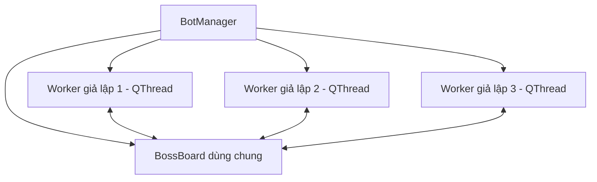
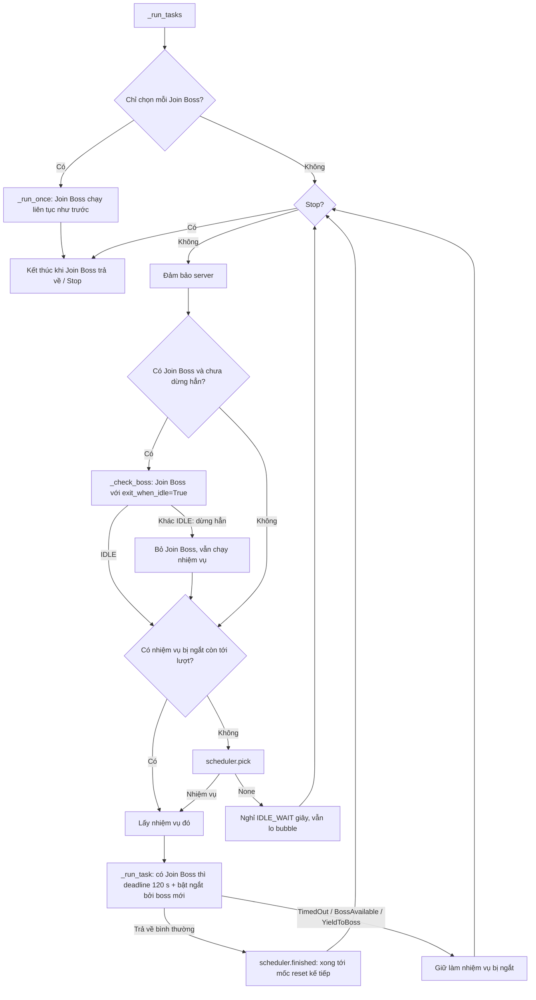
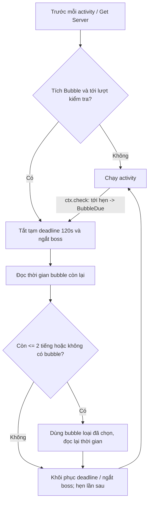
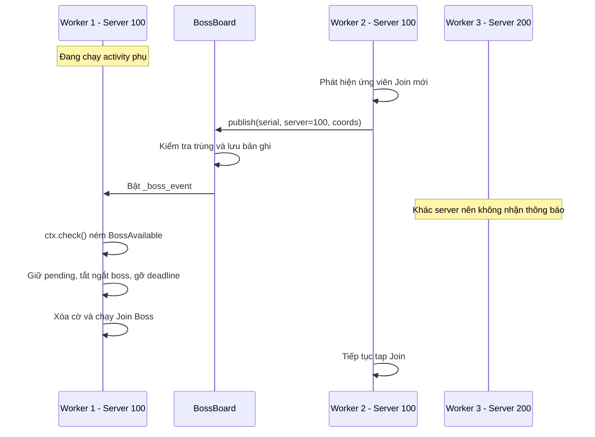

# Flow hiện tại của EvonyBot

Tài liệu mô tả cách code hiện tại chạy activity và thông báo boss giữa các giả lập cùng server.

## 1. Các thành phần

| Thành phần | Vai trò |
| --- | --- |
| [BotManager](bot/worker/manager.py) | Quản lý worker theo serial ADB, chuyển tiếp signal cho UI, sở hữu một BossBoard dùng chung. |
| [BotWorker](bot/worker/bot_worker.py) | Một QThread cho mỗi giả lập được bật bot; điều phối các activity. |
| [BotContext](bot/context/bot_context.py) | Cung cấp thao tác thiết bị, chụp màn hình, settings và cơ chế kiểm tra ngắt. |
| [FlowMixin](bot/context/flow.py) | Kiểm tra Stop, thông báo boss, timeout; cung cấp sleep có thể ngắt. |
| [BossBoard](bot/worker/boss_board.py) | Lưu dấu các boss đã báo và bật cờ thông báo cho worker cùng server; bảo vệ dữ liệu bằng Lock. |
| [Join Monster War](bot/activities/join_monster_war/run.py) | Tìm rally để Join, báo boss cho BossBoard, trả về IDLE khi rảnh nếu được yêu cầu. |
| [ACTIVITIES](bot/activities/__init__.py) | Ánh xạ tên activity sang hàm thực thi. |

Không có luồng giám sát riêng. Các worker gọi trực tiếp BossBoard dùng chung; mỗi worker có một threading.Event để nhận thông báo boss.



Các giả lập chạy đồng thời. Trong mỗi worker, các activity chạy tuần tự trên cùng luồng; `_run_activity()` không tạo luồng mới.

## 2. Bắt đầu chạy một giả lập

1. UI gọi `BotManager.start(serial, activities, settings)`.
2. Manager từ chối nếu serial đã có worker hoặc danh sách activity rỗng.
3. Manager tạo BotWorker, truyền BossBoard dùng chung, nối signal và lưu vào `_workers`.
4. `worker.start()` khởi động luồng và gọi `BotWorker.run()`.
5. Worker báo trạng thái Running, lấy thiết bị ADB và tạo BotContext.
6. Worker gắn settings, callback `report_boss` và đăng ký nhận thông báo nếu đã chọn Join Monster War.
7. Worker chạy vòng lặp nhiệm vụ `_run_tasks()` (mục 3).

Server ban đầu lấy từ `settings["Initialization"]["server"]`. Nếu chưa có, `_ensure_server()` thử đọc trong game và cập nhật đăng ký với BossBoard khi đọc được. Server đã có sẽ không được đọc lại trong lượt chạy.

## 3. Vòng lặp nhiệm vụ: `_run_tasks()`

Worker chạy theo **nhiệm vụ** (bot/worker/TODO.md). Bước 1: mỗi activity đã chọn (trừ Join Boss) là 1 nhiệm vụ chạy
nguyên khối ([tasks.py](tasks.py)); độ ưu tiên = cao nhất trong các nhiệm vụ của nhóm đó trong
[priority.json](priority.json) (số lớn hơn làm trước). Bộ chọn [scheduler.py](scheduler.py) lấy nhiệm vụ tới lượt có ưu
tiên cao nhất; cùng ưu tiên thì xoay vòng (nhiệm vụ lâu chưa được bắt đầu nhất đi trước).

**Giờ reset server** (mốc làm lại nhiệm vụ đã xong): người dùng chọn ở màn Home (ô "Reset Time", "HH:MM", mặc định 14:00), lưu bảng `settings` của DB, dùng chung mọi thiết bị qua `ServerClock`; đổi là các worker đang chạy dùng ngay. Bot không vào game đọc giờ reset nữa (đã xoá `get_server_time` / OCR `read_server_time`).

Thứ tự ưu tiên: **Bubble > Join Boss > nhiệm vụ**. Bubble và Join Boss có luật riêng trong code (mục 3b, các ý dưới).



- **Mỗi vòng có Join Boss: 1 lượt Join Boss rồi đúng 1 nhiệm vụ**, tối đa `OTHERS_WINDOW` = 120 giây cho **từng** nhiệm vụ
  (không còn ngân sách chung cả nhóm). Xong nhiệm vụ là quay lại Join Boss ngay. Mỗi nhiệm vụ đi kèm một lượt kiểm tra
  boss: Join Boss rảnh vẫn cuộn danh sách War 6 lần rồi mới nhường.
- Nhiệm vụ bị ngắt (hết 120 giây, có boss mới, `yield_to_boss`) được làm lại **đầu tiên** ở vòng sau, gọi lại từ đầu
  hàm activity; worker không lưu tiến độ nội bộ (activity tự bỏ qua phần đã `mark_daily_done`).
- **Nhiệm vụ xong** thì không tới lượt nữa cho tới mốc reset server kế tiếp (tính theo mốc lúc bắt đầu lượt làm xong);
  qua mốc thì tự tới lượt lại (trước đây chỉ Daily Activities được thêm lại).
- **Hẹn chạy lại**: activity gán `ctx.again_after` (giây) trước khi return (VD Daily Activities: Alliance Donation
  chưa xong, chờ lượt free hồi) → `scheduler.finished(task, again_after=...)`: tới giờ hẹn thì nhiệm vụ lại tới lượt
  dù chưa qua mốc reset, với độ ưu tiên `AGAIN_PRIORITY` (-1000: chỉ chạy khi không còn nhiệm vụ nào khác tới lượt).
- **Không còn nhiệm vụ tới lượt**: nghỉ `IDLE_WAIT` = 5 giây (qua `_with_bubble`) rồi xét lại; có Join Boss thì mỗi vòng
  vẫn kiểm tra boss. **Thread vẫn sống tới khi Stop**, kể cả khi không chọn Join Boss.
- **Không chọn Join Boss: không có luật 120 giây** (không deadline, không ngắt bởi boss mới).
- **Không tích Bubble: không có luật Bubble** (`_ensure_bubble` không làm gì, không hẹn `BubbleDue`).
- Join Boss trả về khác IDLE (dừng hẳn, VD hết thể lực và không cho dùng vật phẩm): không gọi lại Join Boss, vẫn chạy
  các nhiệm vụ.
- Trước mỗi nhiệm vụ: `_with_bubble(None, ctx.check)` — lo bubble trước (không có Join Boss thì không có bước nào khác
  lo), rồi xét Stop / boss mới.
- Tên activity không tồn tại trong ACTIVITIES: ghi log, chờ 1 giây qua `ctx.sleep()`, coi như xong.

## 3b. Bubble (khiên): ưu tiên hơn mọi activity

Bật khi tích **Bubble** ở tab Initialization (`settings["Initialization"]["bubble"]`), loại dùng lấy từ ô select (`bubble_type`: 8h / 24h / 3d / 7d, mặc định 24h). Thao tác trong game là `keep_bubble()` ở [bot/common/bubble.py](bot/common/bubble.py), làm trong một lần vào game:

1. Màn hình chính: bấm icon buff (`Bubble/1.png`) để mở City Buff. Popup `exit` được đóng và nút `click` được bấm trước.
2. City Buff: dòng Truce Agreement có thanh thời gian thì OCR (font `Timer`). Còn hơn 2 tiếng thì thoát ra, không dùng. Không có thanh hoặc còn ít hơn thì bấm icon Truce.
3. Use Item: tìm tiêu đề dòng của loại đã chọn (4 dòng xếp 8h, 24h, 3d, 7d), bấm nút cùng dòng (Use hoặc giá kim cương).
4. Popup Confirm (thay bubble đang có, dùng, mua): bấm Confirm, bình thường tối đa 2 lần.
5. Về Use Item: đọc `Remaining Time` mới, BACK 2 lần về màn hình chính. Đọc 3 lần không ra thời gian mới thì tính theo loại vừa dùng.



- Hẹn lần sau: bubble còn hơn 2 tiếng thì hẹn đúng lúc còn 2 tiếng; đọc hoặc dùng không được thì 5 phút sau thử lại (`BUBBLE_RETRY`), không đọc lại trước từng activity.
- Tới hẹn, `ctx.check()` ném `BubbleDue` ở bất kỳ activity nào, kể cả Join Boss. Thứ tự ưu tiên: Stop → Bubble → thông báo boss → timeout.
- `_with_bubble()` bắt `BubbleDue`, xử lý bubble rồi gọi lại activity từ đầu (giống khi timeout). Bước bubble không bị deadline 120 giây hoặc thông báo boss cắt ngang.
- Mỗi lần biết thời gian, worker phát `bubble_found(serial, giây)`; main lưu thời điểm bubble hết vào cột `devices.bubble_until` và UI đếm ngược ở tab Initialization (ẩn khi không có bubble).
- Lần chạy sau, worker đọc `bubble_until` từ DB: còn hơn 2 tiếng thì không vào game kiểm tra, chỉ hẹn lúc còn 2 tiếng. `bubble_until` không bị chép qua Apply ALL.
- OCR thời gian (font `Timer`): dưới 1 ngày game hiện `06:55:22`, từ 1 ngày trở lên hiện `2d 23:38`.
- Không đủ kim cương (khi có ảnh `Bubble/noGems.png`): bỏ tích Bubble và không thử lại.

## 4. Khi nào Join Boss phát thông báo?

Trong `_Boss._join()`:

1. Tìm nút Join trong vùng màn hình hợp lệ.
2. Loại các nút đã xử lý trong màn hình hiện tại.
3. Nếu có template hỗ trợ, OCR tọa độ boss; bỏ qua tọa độ còn trong `BossMemory` của giả lập (đã tham gia hoặc đã bỏ qua trong 6 phút gần nhất).
4. OCR tên boss; bỏ qua boss không được tích ở tab Join Monster War (hoặc không nhận ra tên) và nút có chữ đỏ.
5. Gọi `bot.report_boss(coords)` ngay trước khi tap Join.
6. Tap Join, ghi nhớ boss đã xử lý và tiếp tục flow tham gia rally.

Thông báo được phát trước khi xác nhận tham gia thành công. Nó phản ánh một ứng viên Join mà worker phát hiện, không đảm bảo mọi tài khoản đều tham gia được. Boss bị worker nguồn bỏ qua ở các bước lọc trên sẽ không được báo.

## 5. Dữ liệu dùng chung và lọc server

BossBoard hiện dùng dictionary trong bộ nhớ:

```text
_bosses[(server, (x, y))] = thời điểm hết hạn
_listeners[serial] = (server, event của worker)
```

Khi `publish(serial, server, coords)` được gọi:

1. Chuyển server thành chuỗi và bỏ khoảng trắng hai đầu.
2. Nếu server rỗng thì không phát thông báo.
3. Trong Lock, dọn bản ghi hết hạn.
4. Nếu khóa boss còn tồn tại thì bỏ qua thông báo trùng.
5. Lưu bản ghi mới và bật event cho listener cùng server, ngoại trừ worker nguồn.

| Trường hợp | Khóa chống trùng | Thời hạn |
| --- | --- | --- |
| Đọc được tọa độ | `(server, (x, y))` | 120 giây mặc định |
| Không đọc được tọa độ | `(server, None)` | 10 giây |

Thời hạn này chỉ dùng chống thông báo trùng, không phải thời gian còn lại của rally trong game. Thông báo trùng không gia hạn bản ghi. Bản ghi hết hạn được dọn khi có lần publish tiếp theo.

Các worker nhận thông báo phải bật Join Monster War. Việc so khớp chỉ dựa trên chuỗi server sau khi bỏ khoảng trắng; không lọc liên minh. Worker mới đăng ký không được phát lại các thông báo cũ.

BossBoard không chuyển tọa độ cho worker nhận để chọn đúng rally. Event chỉ yêu cầu worker chuyển sang Join Boss; worker đó tự quét danh sách rally trên màn hình của mình. Nhiều thông báo có thể gộp thành một cờ đang bật.

## 6. Ví dụ hai giả lập cùng server



Nếu một thông báo đến trong lúc worker đang Join Boss, nó không ngắt Join Boss. Cờ có thể khiến worker quay lại kiểm tra boss ngay khi chuẩn bị chạy activity phụ. Cờ được xóa trước mỗi lượt Join Boss trong vòng ưu tiên.

## 7. Ý nghĩa của “chuyển ngay”

`BotContext.check()` kiểm tra theo thứ tự:

1. Stop → ném `StopRequested`.
2. Đang cho phép ngắt boss và event đã bật → ném `BossAvailable`.
3. Đã hết deadline → ném `TimedOut`.

Ngắt boss chỉ được bật trong lúc chạy một nhiệm vụ của `_run_task()` (khi có Join Boss). Nó không ngắt chính Join Boss.

Worker phản hồi tại lần check kế tiếp. `ctx.sleep()` kiểm tra tối đa mỗi khoảng 0,2 giây trong vòng chờ; lời gọi ADB hoặc thao tác chặn đang chạy phải kết thúc trước khi worker có thể check tiếp. Không có cơ chế cưỡng chế dừng thread.

Sau ngắt, worker gọi flow Join Boss hiện có từ màn hình đang đứng; không có bước phục hồi màn hình riêng trong scheduler. Join Boss tự xử lý màn hình qua nhận diện, Back và fallback `go_home()`.

Nếu tất cả worker đều đang làm activity phụ, không có worker quét boss liên tục để phát thông báo. Deadline 120 giây vẫn giúp các worker quay lại kiểm tra.

## 8. Stop, lỗi và kết thúc

1. `BotManager.stop(serial)` đặt cờ Stop của worker và báo UI trạng thái Stopping.
2. Activity gặp `ctx.check()` sẽ ném StopRequested; Stop được ưu tiên hơn thông báo boss và timeout.
3. Khi thoát cửa sổ activity phụ, khối finally luôn tắt ngắt boss và gỡ deadline.
4. `BotWorker.run()` bắt BotInterrupted và kết thúc với Stopped; lỗi khác được ghi log và trả trạng thái Error kèm nội dung lỗi.
5. Khối finally của worker hủy đăng ký BossBoard, đặt activity hiển thị thành `"None"` và phát trạng thái cuối.
6. Khi QThread phát finished, manager xóa worker khỏi `_workers`, gọi deleteLater và báo `running_changed(serial, False)`.

## 9. Kiểm thử hiện có

File [tests/worker/test_boss_notifications.py](../../tests/worker/test_boss_notifications.py) kiểm tra:

- Lọc đúng server, không báo lại worker nguồn, chống trùng, hết hạn và hủy đăng ký.
- Chỉ ngắt activity phụ; Stop được ưu tiên.
- Thông báo đưa worker về Join Boss, giữ activity đang dở để gọi lại và dọn deadline đúng cách.

Chạy trên Windows từ thư mục dự án:

```powershell
.\venv\Scripts\python.exe -m unittest discover -s tests -v
```

Các kiểm thử này mô phỏng điều phối trong code, không xác nhận thao tác Join thực tế trên giả lập.
